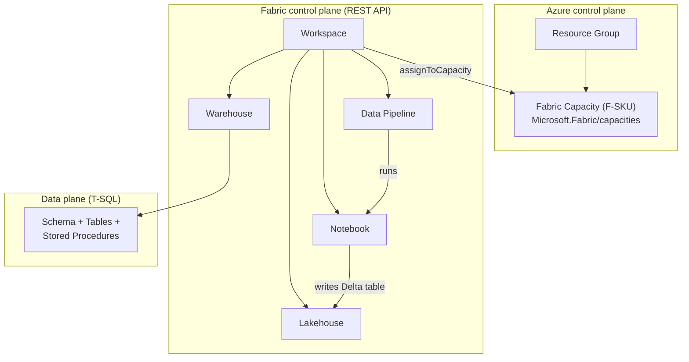

# Fabric-as-Code

Deploy **Microsoft Fabric end-to-end, from nothing to a running analytics platform**, using nothing but the Azure CLI, Bicep, and the Fabric REST APIs. This repository provisions an Azure Fabric **capacity**, creates a **workspace**, binds the workspace to the capacity, and deploys real **items inside it** — a Lakehouse, a Warehouse (with schema, tables and **stored procedures**), a **Notebook**, and a **Data Pipeline** that orchestrates them.

Everything is **scripted, idempotent, and parameter-driven**, so you can repeat the exact same deployment across **other tenants, subscriptions, or resource groups** by changing a single config file.

> This is a **public** reference repository. It contains **no secrets**. All tenant-, subscription-, and credential-specific values live in a git-ignored `.env` file that you create locally from [`.env.example`](.env.example).

> 📸 See [docs/SCREENSHOTS.md](docs/SCREENSHOTS.md) for a visual walkthrough of a live deployment (Azure capacity + all Fabric items).
>
> 🖥️ Slides: [docs/presentation.md](docs/presentation.md) (Marp) · [docs/Fabric-as-Code.pptx](docs/Fabric-as-Code.pptx) · [docs/Fabric-as-Code.pdf](docs/Fabric-as-Code.pdf)
>
> 🏗️ Prefer Terraform? There's a parallel implementation in [terraform/](terraform/) (azurerm + the `microsoft/fabric` provider) that produces the same environment.

---

## What "Fabric-as-Code" means here

Microsoft Fabric has two distinct control planes, and a complete IaC story has to cover **both**:

| Layer | What it manages | Tooling used here |
| --- | --- | --- |
| **Azure control plane** | The Fabric **capacity** (`Microsoft.Fabric/capacities`) — the billable compute SKU (F2…F2048). | Azure CLI + **Bicep** ([`infra/capacity.bicep`](infra/capacity.bicep)) |
| **Fabric control plane** | **Workspaces** and **items** (Lakehouse, Warehouse, Notebook, Pipeline, …). | **Fabric REST API** (`https://api.fabric.microsoft.com/v1`) driven by scripts |
| **Data plane** | Objects *inside* an item — e.g. **stored procedures** in the Warehouse. | T-SQL via `sqlcmd` against the Warehouse SQL endpoint |

The Azure portal/ARM **cannot** create workspaces or items — those only exist in the Fabric REST API. That is why this repo combines Bicep (for the capacity) with REST calls (for everything inside Fabric).

---

## Architecture



End-to-end flow executed by the scripts:

1. **Provision** a resource group + Fabric capacity (Bicep).
2. **Create** a Fabric workspace (REST).
3. **Assign** the workspace to the capacity (REST).
4. **Deploy items** — Lakehouse, Warehouse, Notebook, Data Pipeline (REST, from definition files).
5. **Deploy stored procedures** into the Warehouse (T-SQL via `sqlcmd`).
6. *(optional)* **Connect the workspace to Git** for ongoing source control.

---

## Repository layout

```
fabric-as-code/
├── README.md                     ← you are here
├── .env.example                  ← copy to .env and fill in (git-ignored)
├── .gitignore                    ← keeps secrets/state out of the repo
├── config/
│   └── environment.example.json  ← optional structured config alternative
├── infra/
│   ├── capacity.bicep            ← the Fabric capacity resource
│   └── capacity.parameters.example.json
├── fabric-items/                 ← declarative definitions of Fabric content
│   ├── notebooks/notebook-content.ipynb
│   ├── pipelines/pipeline-content.json   (templated with __TOKENS__)
│   └── sql/
│       ├── 01-create-schema.sql
│       ├── 02-create-tables.sql
│       └── 03-stored-procedures.sql
└── scripts/
    ├── powershell/               ← Windows-first, cross-platform with pwsh 7+
    │   ├── 00-prerequisites.ps1
    │   ├── 01-login.ps1
    │   ├── 02-provision-capacity.ps1
    │   ├── 03-create-workspace.ps1
    │   ├── 04-assign-capacity.ps1
    │   ├── 05-deploy-items.ps1
    │   ├── 06-deploy-stored-procedures.ps1
    │   ├── 07-git-integration.ps1   (optional)
    │   ├── 99-teardown.ps1
    │   ├── common.ps1               (shared helpers)
    │   └── deploy-all.ps1           (orchestrator)
    └── bash/                      ← Linux/macOS equivalents
        ├── 00-prerequisites.sh … 06-deploy-stored-procedures.sh
        ├── 99-teardown.sh
        ├── common.sh
        └── deploy-all.sh
```

The numbered scripts can be run **individually** (to learn/debug each stage) or all at once via the **`deploy-all`** orchestrator.

---

## Prerequisites

| Tool | Purpose | Install |
| --- | --- | --- |
| **Azure CLI** (`az`) | Login, capacity deployment, token acquisition | <https://aka.ms/azcli> |
| **PowerShell 7+** (`pwsh`) *or* **bash + jq** | Run the scripts | <https://aka.ms/powershell> / <https://jqlang.github.io/jq> |
| **go-sqlcmd** | Deploy stored procedures *(bash path only)* | <https://aka.ms/go-sqlcmd> |

> The **PowerShell** stored-procedure step needs **no extra tooling** — it connects to the Warehouse with .NET `SqlClient` using an Entra access token from your `az` session. `sqlcmd` is only required for the **bash** path.

Identity / tenant requirements:

- **Fabric must be enabled** in the tenant, and the **"Service principals can use Fabric APIs"** tenant setting must be **On** if you authenticate with a service principal (Fabric Admin Portal → *Developer settings*).
- The identity you run as must be able to **create resources** in the target subscription/RG and must be a **capacity administrator** (set via `CAPACITY_ADMINS`) so it can see and assign the capacity in Fabric.

---

## Quick start

### 1. Configure

```bash
cp .env.example .env      # PowerShell: Copy-Item .env.example .env
```

Edit `.env` and set at least: `TENANT_ID`, `SUBSCRIPTION_ID`, `RESOURCE_GROUP`, `LOCATION`, `CAPACITY_NAME`, and `CAPACITY_ADMINS`.

### 2. Deploy everything

**PowerShell (Windows / cross-platform):**

```powershell
pwsh ./scripts/powershell/deploy-all.ps1
```

**Bash (Linux / macOS):**

```bash
chmod +x scripts/bash/*.sh
./scripts/bash/deploy-all.sh
```

When it finishes, open <https://app.fabric.microsoft.com> and you'll see the workspace with the Lakehouse, Warehouse, Notebook, and Pipeline, plus the stored procedures inside the Warehouse.

### 3. Run a stage at a time (optional, great for learning)

```powershell
pwsh ./scripts/powershell/01-login.ps1
pwsh ./scripts/powershell/02-provision-capacity.ps1
pwsh ./scripts/powershell/03-create-workspace.ps1
pwsh ./scripts/powershell/04-assign-capacity.ps1
pwsh ./scripts/powershell/05-deploy-items.ps1
pwsh ./scripts/powershell/06-deploy-stored-procedures.ps1
```

Each step writes the GUIDs it resolves (workspace id, item ids, …) into a local `.state.json` (git-ignored) so later steps can pick them up.

---

## How each stage works

### Step 1 — Login ([`01-login.ps1`](scripts/powershell/01-login.ps1))
Authenticates with the Azure CLI. If `SP_CLIENT_ID`/`SP_CLIENT_SECRET` are set in `.env`, it does a **non-interactive service-principal login** (ideal for CI/CD); otherwise it does an interactive `az login`. It then mints a **Fabric API token** to validate access:

```bash
az account get-access-token --resource https://api.fabric.microsoft.com
```

### Step 2 — Provision capacity ([`02-provision-capacity.ps1`](scripts/powershell/02-provision-capacity.ps1) + [`infra/capacity.bicep`](infra/capacity.bicep))
Creates the resource group and deploys the **`Microsoft.Fabric/capacities`** resource via Bicep. The SKU (`F2` by default) and `administration.members` come from `.env`. F2 is the cheapest SKU and is perfect for demos; you can scale to F64+ later (F64 unlocks Copilot and Power BI features) **without re-creating** the capacity.

### Step 3 — Create workspace ([`03-create-workspace.ps1`](scripts/powershell/03-create-workspace.ps1))
`POST /v1/workspaces`. Idempotent — if a workspace with the same display name already exists, it is reused.

### Step 4 — Assign capacity ([`04-assign-capacity.ps1`](scripts/powershell/04-assign-capacity.ps1))
Resolves the capacity's **Fabric GUID** (via `GET /v1/capacities`, which differs from the ARM resource name) and calls `POST /v1/workspaces/{id}/assignToCapacity`. A workspace must be on a capacity before non-Power-BI items (Lakehouse/Warehouse/etc.) will work.

### Step 5 — Deploy items ([`05-deploy-items.ps1`](scripts/powershell/05-deploy-items.ps1))
Creates four items. Notebook and Pipeline are deployed from **definition files** that are base64-encoded and sent as item `definition.parts` — this is the canonical Fabric pattern for source-controlled content.

- **Lakehouse** — `POST /workspaces/{id}/lakehouses`
- **Warehouse** — `POST /workspaces/{id}/warehouses` (a long-running operation; the helper polls `Operation-Location` until `Succeeded`)
- **Notebook** — `POST /workspaces/{id}/notebooks` with [`notebook-content.ipynb`](fabric-items/notebooks/notebook-content.ipynb)
- **Data Pipeline** — `POST /workspaces/{id}/items` (type `DataPipeline`) with [`pipeline-content.json`](fabric-items/pipelines/pipeline-content.json). The template's `__NOTEBOOK_ID__` / `__WORKSPACE_ID__` tokens are substituted with real GUIDs at deploy time, then base64-encoded.

### Step 6 — Deploy stored procedures ([`06-deploy-stored-procedures.ps1`](scripts/powershell/06-deploy-stored-procedures.ps1))
Reads the Warehouse's SQL endpoint from `GET /workspaces/{id}/warehouses/{whId}` (`properties.connectionString`). The **PowerShell** version connects with .NET `SqlClient` using an **Entra access token** acquired from your `az` session (no `sqlcmd` needed, fully non-interactive); the **bash** version uses `sqlcmd` with `ActiveDirectoryAzCli`. The scripts create a `sales` schema, two tables, and two idempotent stored procedures ([`fabric-items/sql/`](fabric-items/sql)):

- `sales.usp_seed_orders` — loads demo rows
- `sales.usp_refresh_orders_summary` — rebuilds an aggregate table

### Step 7 — Git integration (optional, [`07-git-integration.ps1`](scripts/powershell/07-git-integration.ps1))
Connects the workspace to **Azure DevOps** or **GitHub** so items become source-controlled (`git/connect` + `git/initializeConnection`). Skipped unless `GIT_PROVIDER` is set in `.env`.

---

## Repeating across tenants, subscriptions, or resource groups

The whole point of this repo is repeatability. To stand up an **identical** environment somewhere else:

1. **Duplicate the config**, e.g. `.env.dev`, `.env.test`, `.env.customerA`.
2. Change the tenant/subscription/RG/capacity values in that file.
3. Point the scripts at it. Examples:

   **PowerShell** — the loader reads `../../.env` by default; copy the right file over, or set it per run:
   ```powershell
   Copy-Item .env.customerA .env
   pwsh ./scripts/powershell/deploy-all.ps1
   ```

   **Bash** — pass a different env file path:
   ```bash
   cp .env.customerA .env
   ./scripts/bash/deploy-all.sh
   ```

Because every step is **idempotent** and **name-driven**, re-running against an existing environment is safe — existing workspaces/items are detected and reused rather than duplicated. For fully automated **multi-tenant CI/CD**, use a **service principal per tenant** (`SP_CLIENT_ID`/`SP_CLIENT_SECRET`) and store those secrets in your pipeline's secret store (GitHub Actions secrets, Azure DevOps variable groups / Key Vault) — **never in this repo**.

---

## Teardown

To remove everything (deletes the workspace and the entire resource group, including the capacity):

```powershell
pwsh ./scripts/powershell/99-teardown.ps1     # asks you to type the RG name to confirm
```
```bash
./scripts/bash/99-teardown.sh
```

---

## Cost note

A Fabric capacity bills **per hour while it exists**, regardless of usage. For demos:

- Use the smallest SKU (**F2**).
- **Pause** the capacity when idle (Azure portal → the capacity → *Pause*) to stop compute billing, or run the teardown script.
- OneLake storage is billed separately and is minimal for demo data.

---

## Security & public-repo hygiene

- **No secrets are committed.** `.env`, `.state.json`, and `*.parameters.json` are all git-ignored.
- Prefer **service principals with least privilege** for automation; grant them only capacity-admin + the RBAC needed to deploy the capacity.
- Keep client secrets in your **CI/CD secret store** or **Azure Key Vault**, injected as environment variables at runtime.
- The included definitions contain only **sample, non-sensitive demo data**.

---

## API reference

- Fabric REST API: <https://learn.microsoft.com/rest/api/fabric/>
- Fabric capacity (Bicep/ARM): <https://learn.microsoft.com/azure/templates/microsoft.fabric/capacities>
- Fabric Git integration: <https://learn.microsoft.com/rest/api/fabric/core/git>
- Item definitions: <https://learn.microsoft.com/rest/api/fabric/articles/item-management/definitions/>
