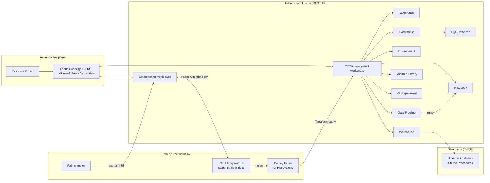

# Fabric-as-Code

Deploy **Microsoft Fabric end-to-end, from nothing to a running analytics platform**, with either Terraform or Azure CLI/Bicep/Fabric REST scripts. The Terraform workflow provisions an Azure Fabric **capacity** plus separate **Git authoring** and **CI/CD deployment** workspaces, then deploys nine item types to CI/CD: Lakehouse, Warehouse (with schema, tables and **stored procedures**), Environment, Eventhouse, KQL Database, Variable Library, ML Experiment, Notebook, and Data Pipeline.

For the current P0 scope, `item_deployment_profile = "p0"` deploys only the green item set: **Lakehouse, Warehouse, and Notebook**. The same configuration can apply workspace role assignments, assign or rotate customer-managed keys, and connect the Git authoring workspace to an existing repository. The default `all` profile preserves the complete demo above.

Everything is **scripted, idempotent, and parameter-driven**, so you can repeat the exact same deployment across **other tenants, subscriptions, or resource groups** by changing a single config file.

> This is a **public** reference repository. It contains **no secrets**. The script path reads a git-ignored `.env`; Terraform uses `.tfvars` locally and GitHub Environment variables in CI.

> 🔎 See [docs/SCREENSHOTS.md](docs/SCREENSHOTS.md) for an environment-neutral checklist of expected deployment results.
>
> 🖥️ Slides: [docs/presentation.md](docs/presentation.md) (Marp source) · [docs/Fabric-as-Code.pptx](docs/Fabric-as-Code.pptx) · [docs/Fabric-as-Code.pdf](docs/Fabric-as-Code.pdf)
>
> 🏗️ Start with the [end-to-end Terraform deployment guide](docs/deployment/README.md). Its [resource destination map](docs/deployment/README.md#find-each-deployed-resource) shows where every core resource is deployed and links to its Terraform or direct API owner.
>
> 🤝 See [Working from code and the Fabric UI](docs/WORKING_WITH_FABRIC.md) before enabling Git integration or editing managed items in a workspace.
>
> 🔌 Use the [REST API call-site index](docs/REST_API_USAGE.md#direct-calls-made-by-ci) to trace direct CI requests, or [REST API usage](docs/REST_API_USAGE.md#optional-direct-rest-scripts) to find the implementing script for every fallback route.
>
> 📚 See [deployment sources](docs/DEPLOYMENT_SOURCES.md) for the implementation-to-official-documentation map covering every deployed component.
>
> ✅ See [delivery scope](docs/DELIVERY_SCOPE.md) for the screenshot-aligned acceptance matrix, including explicit external prerequisites and out-of-scope items.
>
> 🤖 See [GitHub Copilot tooling](docs/GHCP_TOOLING.md) for the shared agent, skill, prompt, instructions, and Azure/GitHub MCP configuration.
>
> 🔒 Share the standalone [customer GitHub VNet runner setup guide](docs/CUSTOMER_GITHUB_VNET_RUNNER_SETUP.md), which includes the required Terraform and workflow code inline.
>
---

## What "Fabric-as-Code" means here

Microsoft Fabric has two distinct control planes, and a complete IaC story has to cover **both**:

| Layer | What it manages | Tooling used here |
| --- | --- | --- |
| **Azure control plane** | The Fabric **capacity** (`Microsoft.Fabric/capacities`) — the billable compute SKU (F2…F2048). | **Terraform** or Azure CLI + **Bicep** ([`infra/capacity.bicep`](infra/capacity.bicep)) |
| **Fabric control plane** | **Workspaces** and **items** (data, real-time, data science, and orchestration workloads). | Fabric Terraform provider or **Fabric REST API** (`https://api.fabric.microsoft.com/v1`) |
| **Data plane** | Objects *inside* an item — e.g. **stored procedures** in the Warehouse. | Terraform-triggered T-SQL via `SqlClient`; `sqlcmd` is used by the Bash alternative. |

The Azure portal/ARM does not create Fabric workspaces or items. The default pipeline delegates those Fabric API operations to the Terraform provider; the numbered Bicep/REST scripts are an alternate learning and troubleshooting path.

---

## Architecture


```mermaid
flowchart LR
    subgraph Source["Daily source workflow"]
        DEV["Fabric author"]
        REPO["GitHub repository<br/>fabric-git/ definitions"]
        GHA["Deploy Fabric<br/>GitHub Actions"]
        REPO -->|merge| GHA
    end
    subgraph Azure["Azure control plane"]
        RG["Resource Group"] --> CAP["Fabric Capacity (F-SKU)<br/>Microsoft.Fabric/capacities"]
    end
    subgraph Fabric["Fabric control plane (REST API)"]
        GITWS["Git authoring workspace"]
        CICDWS["CI/CD deployment workspace"]
        CICDWS --> LH["Lakehouse"]
        CICDWS --> WH["Warehouse"]
        CICDWS --> ENV["Environment"]
        CICDWS --> EH["Eventhouse"]
        EH --> KQL["KQL Database"]
        CICDWS --> VL["Variable Library"]
        CICDWS --> ML["ML Experiment"]
        CICDWS --> NB["Notebook"]
        CICDWS --> PL["Data Pipeline"]
    end
    subgraph Data["Data plane (T-SQL)"]
        WH --> SP["Schema + Tables +<br/>Stored Procedures"]
    end
    CAP --> GITWS
    CAP --> CICDWS
    DEV -->|author in UI| GITWS
    GITWS <-->|Fabric Git: fabric-git/| REPO
    GHA -->|Terraform apply| CICDWS
    PL -->|runs| NB
```

In full-platform mode, the default workflow creates the resource group,
capacity, and both workspaces. Managed-existing mode uses a supplied capacity
and creates or imports both workspaces; externally managed mode consumes their
IDs without owning their lifecycle. `fabric_workspace_git` connects only the
authoring workspace, while the selected Terraform items and T-SQL deploy only
to CI/CD. One operational helper resumes a paused capacity before Terraform and
leaves it active after deployment.

### Terraform P0 coverage

| P0 section | Implementation |
| --- | --- |
| Capacity | [Capacity guide](docs/deployment/01-capacity.md) → [`terraform/modules/capacity/main.tf`](terraform/modules/capacity/main.tf) |
| Workspaces | [Workspace guide](docs/deployment/02-workspaces.md) → [`terraform/modules/workspace/main.tf`](terraform/modules/workspace/main.tf) |
| CMK | [Workspace settings guide](docs/deployment/03-workspace-settings.md) → [`terraform_data.workspace_encryption`](terraform/main.tf) |
| Role assignments | [Workspace settings guide](docs/deployment/03-workspace-settings.md) → [`fabric_workspace_role_assignment.this`](terraform/main.tf) |
| Monitoring | [Workspace settings guide](docs/deployment/03-workspace-settings.md) → [`verify-fabric-network.ps1`](scripts/powershell/verify-fabric-network.ps1) |
| Repository connection | [Git integration guide](docs/deployment/04-git-integration.md) → [`fabric_workspace_git.this`](terraform/main.tf) |
| Items and files | [Content files guide](docs/deployment/05-content-files.md) → [`fabric-git/`](fabric-git) and [`terraform/modules/items/main.tf`](terraform/modules/items/main.tf) |
| Workflows | [End-to-end guide](docs/deployment/README.md) → [`.github/workflows/`](.github/workflows) |

### Expected deployed surfaces

| Surface | Expected result |
| --- | --- |
| CI/CD deployment workspace | Terraform-managed items for the selected `p0` or `all` profile. |
| Git authoring workspace | Supported Fabric items synchronized with `main:/fabric-git`. |
| Git mirror | Native Fabric definitions under [`fabric-git/`](fabric-git). |
| Deployment workflow | A saved plan apply followed by a zero-change convergence plan. |

Fabric workspaces display items, not arbitrary repository files. After Git
initialization, the authoring workspace contains the supported definitions from
`fabric-git/`; the directory README remains visible only in GitHub.

### Daily workflow

1. In the Git lane, run **Update from Git**, author in the Fabric UI, and use **Commit to Git**. Fabric-native definitions stay under `fabric-git/`.
2. Review the resulting native definition changes under `fabric-git/` in a pull request when using a branch workflow.
3. Merge to `main`; the `Deploy Fabric` GitHub Actions workflow starts automatically.
4. Terraform reads those same `fabric-git/` files, renders target IDs in memory, and deploys them to the CI/CD workspace.
5. Validate the CI/CD workspace without editing it directly.

The two workspaces share one definition source but not item-definition
ownership: Fabric Git synchronizes definitions in the authoring workspace,
while Terraform manages definitions in the CI/CD workspace. Depending on the
deployment mode, Terraform may also own the lifecycle of both workspace
containers. See [Working from code and the Fabric UI](docs/WORKING_WITH_FABRIC.md)
for details.

The alternate numbered scripts execute a legacy single-workspace, all-item flow directly:

1. **Provision** a resource group + Fabric capacity (Bicep).
2. **Create** a Fabric workspace (REST).
3. **Assign** the workspace to the capacity (REST).
4. **Deploy nine items** — Lakehouse, Warehouse, Environment, Eventhouse, KQL Database, Variable Library, ML Experiment, Notebook, and Data Pipeline.
5. **Deploy stored procedures** into the Warehouse (T-SQL via `sqlcmd`).
6. *(optional, PowerShell only)* **Connect that same workspace to Git** for ongoing source control.

This script path always deploys all nine items and does not reproduce
Terraform's separate Git-authoring and CI/CD-workspace ownership model. Use it
for learning or isolated troubleshooting, not alongside Terraform management of
the same workspace.

---

## Repository layout

```
fabric-as-code/
├── README.md                     ← you are here
├── .github/
│   ├── agents/ · instructions/ · prompts/ · skills/
│   └── workflows/                ← GHCP tooling and CI/CD workflows
├── .vscode/
│   └── mcp.json                  ← read-only Azure + GitHub MCP endpoints
├── .env.example                  ← copy to .env and fill in (git-ignored)
├── .gitignore                    ← keeps secrets/state out of the repo
├── config/
│   └── environment.example.json  ← structured reference for environment values
├── infra/
│   ├── capacity.bicep            ← the Fabric capacity resource
│   └── capacity.parameters.example.json
├── fabric-git/                   ← canonical Fabric Git-native item definitions
│   ├── lh_git_authoring_demo.Lakehouse/
│   ├── nb_git_authoring_demo.Notebook/
│   ├── pl_git_authoring_demo.DataPipeline/
│   └── sql/                      ← Warehouse data-plane T-SQL source
│       ├── 01-create-schema.sql
│       ├── 02-create-tables.sql
│       └── 03-stored-procedures.sql
├── docs/
│   ├── DELIVERY_SCOPE.md         ← screenshot-aligned acceptance matrix
│   ├── GHCP_TOOLING.md           ← agents, skills, prompts, and MCP setup
│   └── deployment/               ← ordered end-to-end Terraform guides
└── scripts/
    ├── powershell/               ← Windows-first, cross-platform with pwsh 7+
    │   ├── 00-prerequisites.ps1
    │   ├── 01-login.ps1
    │   ├── 02-provision-capacity.ps1
    │   ├── 03-create-workspace.ps1
    │   ├── 04-assign-capacity.ps1
    │   ├── 05-deploy-items.ps1
    │   ├── 06-deploy-stored-procedures.ps1
    │   ├── 07-git-integration.ps1   (optional)
    │   ├── 99-teardown.ps1
    │   ├── common.ps1               (shared helpers)
    │   └── deploy-all.ps1           (orchestrator)
    └── bash/                      ← Linux/macOS equivalents
        ├── 00-prerequisites.sh … 06-deploy-stored-procedures.sh
        ├── 99-teardown.sh
        ├── common.sh
        └── deploy-all.sh

terraform/                        ← full-stack or existing-workspace deployment
├── environments/{dev,prod}.tfvars  ← same stack, environment-specific values
├── providers.tf · variables.tf · main.tf · imports.tf · outputs.tf
├── modules/{capacity,workspace,items,sql}/
└── runner-network/              ← VNet larger runner, firewall, and private state
```

The numbered scripts can be run **individually** (to learn/debug each stage) or all at once via the **`deploy-all`** orchestrator.

> **Terraform modes.** Set `provision_platform = true` to create the resource group, capacity, both workspaces, and the selected CI/CD item profile. For an existing capacity, set `provision_platform = false` and `manage_workspaces = true` to create or import both workspaces while deploying items only to `workspace_id`. Start a new P0 environment from [`terraform/environments/p0.tfvars.example`](terraform/environments/p0.tfvars.example).

---

## Prerequisites

| Tool | Purpose | Install |
| --- | --- | --- |
| **Azure CLI** (`az`) | Login, capacity deployment, token acquisition | <https://aka.ms/azcli> |
| **PowerShell 7+** (`pwsh`) *or* **bash + jq** | Run the scripts | <https://aka.ms/powershell> / <https://jqlang.github.io/jq> |
| **go-sqlcmd** | Deploy stored procedures *(bash path only)* | <https://aka.ms/go-sqlcmd> |

> The **PowerShell** stored-procedure step needs **no extra tooling** — it connects to the Warehouse with .NET `SqlClient` using an Entra access token from your `az` session. `sqlcmd` is only required for the **bash** path.

Identity / tenant requirements:

- **Fabric must be enabled** in the tenant, and the **"Service principals can use Fabric APIs"** tenant setting must be **On** if you authenticate with a service principal (Fabric Admin Portal → *Developer settings*).
- The identity you run as must be able to **create resources** in the target subscription/RG and must be a **capacity administrator** (set via `CAPACITY_ADMINS`) so it can see and assign the capacity in Fabric.

---

## Quick start

### 1. Configure

```bash
cp .env.example .env      # PowerShell: Copy-Item .env.example .env
```

Edit `.env` and set at least: `TENANT_ID`, `SUBSCRIPTION_ID`, `RESOURCE_GROUP`, `LOCATION`, `CAPACITY_NAME`, and `CAPACITY_ADMINS`.

### 2. Deploy everything

**PowerShell (Windows / cross-platform):**

```powershell
pwsh ./scripts/powershell/deploy-all.ps1
```

**Bash (Linux / macOS):**

```bash
chmod +x scripts/bash/*.sh
./scripts/bash/deploy-all.sh
```

When it finishes, open <https://app.fabric.microsoft.com> and you'll see all nine items plus the stored procedures inside the Warehouse.

### 3. Run a stage at a time (optional, great for learning)

```powershell
pwsh ./scripts/powershell/01-login.ps1
pwsh ./scripts/powershell/02-provision-capacity.ps1
pwsh ./scripts/powershell/03-create-workspace.ps1
pwsh ./scripts/powershell/04-assign-capacity.ps1
pwsh ./scripts/powershell/05-deploy-items.ps1
pwsh ./scripts/powershell/06-deploy-stored-procedures.ps1
```

Each step writes the GUIDs it resolves (workspace id, item ids, …) into a local `.state.json` (git-ignored) so later steps can pick them up.

---

## How each stage works

### Step 1 — Login ([`01-login.ps1`](scripts/powershell/01-login.ps1))
Authenticates with the Azure CLI. If `SP_CLIENT_ID`/`SP_CLIENT_SECRET` are set in `.env`, it does a **non-interactive service-principal login** (ideal for CI/CD); otherwise it does an interactive `az login`. It then mints a **Fabric API token** to validate access:

```bash
az account get-access-token --resource https://api.fabric.microsoft.com
```

### Step 2 — Provision capacity ([`02-provision-capacity.ps1`](scripts/powershell/02-provision-capacity.ps1) + [`infra/capacity.bicep`](infra/capacity.bicep))
Creates the resource group and deploys the **`Microsoft.Fabric/capacities`** resource via Bicep. The SKU (`F2` by default) and `administration.members` come from `.env`. F2 is the cheapest SKU and is perfect for demos; you can scale to F64+ later (F64 unlocks Copilot and Power BI features) **without re-creating** the capacity.

### Step 3 — Create workspace ([`03-create-workspace.ps1`](scripts/powershell/03-create-workspace.ps1))
`POST /v1/workspaces`. Idempotent — if a workspace with the same display name already exists, it is reused.

### Step 4 — Assign capacity ([`04-assign-capacity.ps1`](scripts/powershell/04-assign-capacity.ps1))
Resolves the capacity's **Fabric GUID** (via `GET /v1/capacities`, which differs from the ARM resource name) and calls `POST /v1/workspaces/{id}/assignToCapacity`. A workspace must be on a capacity before non-Power-BI items (Lakehouse/Warehouse/etc.) will work.

### Step 5 — Deploy items ([`05-deploy-items.ps1`](scripts/powershell/05-deploy-items.ps1))
Creates or reuses nine items. Notebook and Pipeline are deployed from **definition files** that are base64-encoded and sent as item `definition.parts` — this is the canonical Fabric pattern for source-controlled content.

- **Lakehouse** — `POST /workspaces/{id}/lakehouses`
- **Warehouse** — `POST /workspaces/{id}/warehouses` (a long-running operation; the helper polls `Operation-Location` until `Succeeded`)
- **Environment** — `POST /workspaces/{id}/environments`
- **Eventhouse** — `POST /workspaces/{id}/eventhouses`
- **KQL Database** — `POST /workspaces/{id}/kqlDatabases`, created as a writable child of the Eventhouse
- **Variable Library** — `POST /workspaces/{id}/variableLibraries`
- **ML Experiment** — `POST /workspaces/{id}/mlExperiments`
- **Notebook** — `POST /workspaces/{id}/notebooks` with the canonical [`notebook-content.py`](fabric-git/nb_git_authoring_demo.Notebook/notebook-content.py)
- **Data Pipeline** — `POST /workspaces/{id}/items` (type `DataPipeline`) with the canonical [`pipeline-content.json`](fabric-git/pl_git_authoring_demo.DataPipeline/pipeline-content.json). The deployment renders the target Notebook and workspace IDs in memory without writing a second source file.

### Step 6 — Deploy stored procedures ([`06-deploy-stored-procedures.ps1`](scripts/powershell/06-deploy-stored-procedures.ps1))
Reads the Warehouse's SQL endpoint from `GET /workspaces/{id}/warehouses/{whId}` (`properties.connectionString`). The **PowerShell** version connects with .NET `SqlClient` using an **Entra access token** acquired from your `az` session (no `sqlcmd` needed, fully non-interactive); the **bash** version uses `sqlcmd` with `ActiveDirectoryAzCli`. The scripts create a `sales` schema, two tables, and two idempotent stored procedures ([`fabric-git/sql/`](fabric-git/sql)):

The Terraform path does not make that REST lookup; it passes `fabric_warehouse.properties.connection_string` from provider state into the SQL hook.

- `sales.usp_seed_orders` — loads demo rows
- `sales.usp_refresh_orders_summary` — rebuilds an aggregate table

### Step 7 — Git integration (optional, [`07-git-integration.ps1`](scripts/powershell/07-git-integration.ps1))
Connects the workspace to **Azure DevOps** or **GitHub** so items become source-controlled (`git/connect` + `git/initializeConnection`). Skipped unless `GIT_PROVIDER` is set in `.env`.

This numbered-script fallback remains a single-workspace learning path. Terraform instead manages `git_integration` on its dedicated Git workspace and defaults initialization to `PreferRemote`; it never connects the CI/CD workspace.

---

## Repeating across tenants, subscriptions, or resource groups

The whole point of this repo is repeatability. To stand up an **identical** environment somewhere else:

For the scripts, duplicate `.env.example`, change the environment values, and select the file per run:

```powershell
$env:FABRIC_CONFIG_FILE = (Resolve-Path ./.env.customerA)
pwsh ./scripts/powershell/deploy-all.ps1
```

```bash
FABRIC_CONFIG_FILE="$PWD/.env.customerA" ./scripts/bash/deploy-all.sh
```

For Terraform, create or edit `terraform/environments/<environment>.tfvars`. The guarded script gives each environment a separate Blob state key:

The committed `dev.tfvars` and `prod.tfvars` contain placeholders and the marker `# deployment: template`; trusted workflows will validate but never deploy them. Replace every placeholder and remove that marker before using either file as a deployment target.

```powershell
$env:TF_BACKEND_RESOURCE_GROUP = '<state-resource-group>'
$env:TF_BACKEND_STORAGE_ACCOUNT = '<storage-account>'
$env:TF_BACKEND_CONTAINER = 'tfstate'
pwsh ./scripts/powershell/deploy-terraform.ps1 -Environment dev -VarFile ./terraform/environments/dev.tfvars
pwsh ./scripts/powershell/deploy-terraform.ps1 -Environment prod -VarFile ./terraform/environments/prod.tfvars
```

The state account has public access disabled, so run from the configured GitHub VNet or a connected network. Terraform is state-driven, while the alternate scripts are idempotent and name-driven. Never share Terraform state between environments. For automated multi-tenant CI/CD, use a separate federated identity or service principal per tenant and keep credentials in the pipeline's secret store, never in this repository.

---

## GitHub Actions deployment

The unprivileged [Validate Fabric Terraform workflow](.github/workflows/validate-fabric.yml) checks each added or changed `terraform/environments/<environment>.tfvars` on a public runner. It has read-only permissions, persists no checkout credentials, receives no OIDC token, opens no GitHub Environment, and runs formatting, provider validation, mocked plan tests, and the tfvars variable contract without a backend. Terraform warnings, including misspelled variable names, fail validation. Deleting or renaming an environment file is blocked until its state and resources are explicitly retired or migrated.

After merge, the trusted [Deploy Fabric workflow](.github/workflows/deploy-fabric.yml) plans and deploys those same files from `main`. Shared Terraform, PowerShell, workflow, or Fabric definition changes also exercise `dev`. A manual run selects one matching environment file. Each deployment target uses its namesake GitHub Environment for OIDC, approvals, concurrency, and backend access.

The workflow can target a GitHub-hosted larger Windows runner injected into an Azure VNet. [`terraform/runner-network/`](terraform/runner-network) creates the delegated subnet, deny-inbound NSG, Azure Firewall, private Terraform state backend, and `GitHub.Network/networkSettings` binding. The runner subnet routes all egress through the firewall, covering Fabric REST over HTTPS and Warehouse T-SQL over TCP `1433`. GitHub configures this feature through organization network configurations and runner groups; a repository owned by a personal account can't consume the Azure network setting.

The unprivileged environment selector runs on `ubuntu-latest`. Deployment jobs
default to the larger-runner label `fabric-vnet-runner`; define repository or
organization variable `FABRIC_RUNNER_LABELS` as a JSON array when the configured
larger runner uses another label. Migrate existing state from a VNet-connected
administrative host before allowing deployment jobs to run.

The `Verify Fabric Network` workflow can run every six hours on the same VNet
runner. Scheduled execution is disabled until repository or organization
variable `FABRIC_ENABLE_SCHEDULED_CANARY` is set to `true`; manual dispatch stays
available. It verifies current service tags, private state DNS, Fabric REST, and
an authenticated Warehouse TDS query so endpoint-contract drift is detected
even when no deployment has run recently.

Because the job references a GitHub Environment, configure one Entra federated
credential per environment. Use GitHub's issuer and subject format for your
GitHub.com or GHE.com host; data-residency repositories use the immutable
owner/repository-ID subject documented by GitHub. Grant the identity the
least-privilege Azure role needed for the selected mode, capacity read/resume
permission, and the required Fabric workspace role. The Fabric tenant setting
**Service principals can use Fabric APIs** must allow that identity.

Set only operational variables on each GitHub Environment:

- Identity: `AZURE_CLIENT_ID`, `AZURE_TENANT_ID`, and `AZURE_SUBSCRIPTION_ID`
- Private backend: `TF_STATE_RESOURCE_GROUP`, `TF_STATE_STORAGE_ACCOUNT`, and `TF_STATE_CONTAINER`
- Deployment monitoring: `RUNNER_NETWORK_RESOURCE_GROUP`, `RUNNER_FIREWALL_POLICY_NAME`, and `RUNNER_FIREWALL_RULE_COLLECTION_GROUP_NAME`
- Optional scheduled canary: `FABRIC_ENABLE_SCHEDULED_CANARY=true` after the VNet runner and `dev` environment are configured
- Optional inbound policy: `FABRIC_MANAGE_WORKSPACE_FIREWALL` and `FABRIC_DEPLOYMENT_EGRESS_IP`

Capacity, workspace, role, CMK, repository, item, and adoption values belong in the committed environment tfvars. The workflow evaluates that file through Terraform and rejects it when its tenant, subscription, or `deployment_environment` differs from the authenticated GitHub Environment target. The scheduled `dev` canary reads its region, workspace, Warehouse, and optional CMK directly from `dev/terraform.tfstate`.

`FABRIC_MANAGE_WORKSPACE_FIREWALL` defaults to `false`. Set it to `true` only after a Fabric administrator enables both **Configure workspace-level inbound network rules** and **Configure workspace-level IP firewall rules and trusted resource instances** in Advanced networking. Tenant-setting changes can take up to 15 minutes. The fixed `FABRIC_DEPLOYMENT_EGRESS_IP` remains available while this feature is off; Azure Firewall still controls runner egress.

For this repository, a tfvars GitHub connection value has this shape (replace only the configured-connection GUID):

```hcl
git_integration = {
    provider_type   = "GitHub"
    owner_name      = "example-owner"
    repository_name = "fabric-as-code"
    branch_name     = "main"
    directory_name  = "/fabric-git"
    connection_id   = "00000000-0000-0000-0000-000000000000"
}
```

The workflow validates its Azure context and Fabric REST connectivity, resolves the state account to a private endpoint, resumes an existing paused capacity, and runs `terraform init`, `fmt -check`, `validate`, `test`, `plan`, and `apply`. Full-platform first runs allow the capacity to be absent so Terraform can create it. Infrastructure deletes are rejected, a zero-change post-apply plan is required, and the deployment then runs the authenticated network/Fabric/Warehouse/CMK canary from Terraform outputs. Once resumed or created, the capacity remains active after both successful and failed deployments.

Fabric state lives at `<environment>/terraform.tfstate` in the private, versioned Blob container. Migrate every existing local state before selecting the larger runner; an empty remote state would attempt to recreate live Fabric resources. See the [runner-network migration procedure](terraform/runner-network/README.md#migrate-existing-state).

---

## Teardown

To remove everything created by the numbered script path (deletes its workspace and the entire resource group, including the capacity):

```powershell
pwsh ./scripts/powershell/99-teardown.ps1     # asks you to type the RG name to confirm
```
```bash
./scripts/bash/99-teardown.sh
```

---

## Cost note

A Fabric capacity bills **per hour while it exists**, regardless of usage. For demos:

- Use the smallest SKU (**F2**).
- The deployment workflow intentionally leaves capacity active. Pause it manually only when you explicitly want to stop compute billing, or run the teardown script.
- OneLake storage is billed separately and is minimal for demo data.

---

## Security & public-repo hygiene

- **No secrets are committed.** `.env`, `.state.json`, and `*.parameters.json` are all git-ignored.
- Prefer **service principals with least privilege** for automation; grant them only capacity-admin + the RBAC needed to deploy the capacity.
- Keep client secrets in your **CI/CD secret store** or **Azure Key Vault**, injected as environment variables at runtime.
- The included definitions contain only **sample, non-sensitive demo data**.

---

## API reference

- Complete implementation and source map: [docs/DEPLOYMENT_SOURCES.md](docs/DEPLOYMENT_SOURCES.md)
- Repository REST boundary and route inventory: [docs/REST_API_USAGE.md](docs/REST_API_USAGE.md)
- Fabric REST API: <https://learn.microsoft.com/rest/api/fabric/>
- Fabric capacity (Bicep/ARM): <https://learn.microsoft.com/azure/templates/microsoft.fabric/capacities>
- Fabric Git integration: <https://learn.microsoft.com/rest/api/fabric/core/git>
- Item definitions: <https://learn.microsoft.com/rest/api/fabric/articles/item-management/definitions/>
