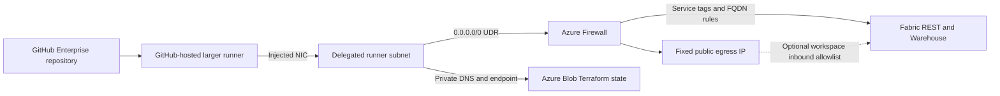

# Customer setup: GitHub VNet runner for Fabric deployments

This guide shows how to deploy continuously to Microsoft Fabric from a
GitHub-hosted larger runner injected into an Azure virtual network. The design
uses Azure Firewall service tags so Microsoft, rather than the customer,
maintains the changing IP prefixes behind Fabric endpoints.

This is a standalone handout. It includes the required resource contract,
critical Terraform policy, GitHub and Entra configuration, state migration, and
workflow examples inline. No access to the publisher's environment is required.

This guide targets GitHub Enterprise Cloud. `ghe.com` means Enterprise Cloud
with data residency; it does not mean self-hosted GitHub Enterprise Server
(GHES). Standard `github.com` Enterprise Cloud uses the same Azure VNet pattern
but a different OIDC issuer and subject format, called out below.

## How Fabric endpoint IPs stay current

Do not copy resolved Fabric IP addresses into static firewall rules. Fabric
Warehouse hostnames can move between Microsoft-owned prefixes as the service
scales or fails over. Azure service tags represent those prefixes and are
updated by Microsoft without requiring customers to rewrite their firewall
policy or run an IP synchronization job.

The reference policy allows:

| Traffic | Azure Firewall destination | Port | Purpose |
| --- | --- | --- | --- |
| Entra authentication | `AzureActiveDirectory` | TCP 443 | GitHub OIDC token exchange and Azure CLI tokens. |
| Azure management | `AzureResourceManager` | TCP 443 | Fabric capacity status and Azure resource operations. |
| Fabric REST and control traffic | `PowerBI` | TCP 443 | Fabric APIs and workload control traffic. |
| Fabric Warehouse TDS | `PowerBI` and `Sql` | TCP 1433 | Warehouse endpoints can resolve into either service tag. |
| GitHub, Terraform, and supporting web endpoints | Managed FQDN rules | TCP 443 | HTTPS destinations outside the Fabric service tags. |

The `PowerBI` and `Sql` combination on TCP 1433 is intentional. During reference
validation, a `*.datawarehouse.fabric.microsoft.com` hostname resolved into the
`PowerBI` service tag, not `Sql`. Allowing only `Sql` caused
`SqlConnection.Open()` to time out even though Fabric REST calls succeeded.

Use the global `PowerBI` and `Sql` tags unless all Fabric home, capacity, and
paired-region behavior has been tested. A workspace in one Azure region can use
an endpoint represented by a different regional tag.

### Resilient to IP rotation, not impervious to every service change

Azure Firewall resolves service-tag membership from Microsoft's current Azure
network metadata. When Microsoft adds or removes IP prefixes inside `PowerBI`,
`Sql`, `AzureActiveDirectory`, or `AzureResourceManager`, the rule follows the
tag automatically; no Terraform change or customer-maintained IP download is
required.

That protects against normal endpoint IP rotation. It does not protect against:

- Microsoft renaming, retiring, or changing the meaning of a service tag.
- Fabric introducing another required tag, protocol, port, or domain.
- Changes to GitHub, Terraform, Fabric, or Power BI FQDN requirements.
- DNS, routing, identity, capacity, regional service, or Azure Firewall outages.
- Customer policy drift that removes a tag, route, delegation, or FQDN rule.

Treat the design as automatically maintained for prefix membership, not as an
immutable contract. Keep deny diagnostics enabled, alert on runner-subnet
denies, review official endpoint guidance, test the IaC contract, and run a
scheduled smoke deployment that reaches both Fabric REST and Warehouse TDS.

Official references:

- [Fabric service tags](https://learn.microsoft.com/fabric/security/security-service-tags)
- [Fabric Warehouse connectivity](https://learn.microsoft.com/fabric/data-warehouse/connectivity#allow-azure-service-tags-through-firewall)
- [Fabric URL allowlist](https://learn.microsoft.com/fabric/security/fabric-allow-list-urls)
- [GitHub Azure private networking](https://docs.github.com/en/organizations/managing-organization-settings/about-azure-private-networking-for-github-hosted-runners-in-your-organization)

## Architecture



The runner has no public IP. Its default route goes through Azure Firewall, and
Terraform state is available only through a private Blob endpoint. The firewall
public IP gives the deployment a stable source address if the customer also
enables Fabric workspace-level inbound rules.

## Customer prerequisites

1. GitHub Enterprise Cloud with larger runners and Azure private networking.
   Standard GitHub-hosted runners can't join a customer VNet.
2. An Azure subscription in a region supported by the customer's GitHub host
   and data-residency geography.
3. Enterprise-owner access for initial hosted-compute networking and the runner
   group.
4. Azure permissions for networking, firewall, private endpoint, storage,
   monitoring, role assignment, and `GitHub.Network/networkSettings` resources.
5. A deployment app registration allowed by the Fabric tenant setting
   **Service principals can use Fabric APIs**.
6. Fabric workspace Admin and Warehouse data-plane permissions for the
   deployment identity.
7. Terraform 1.9 or later, Azure CLI, GitHub CLI, and PowerShell 7.

Azure Firewall Standard and GitHub larger runners are billable resources.
Review sizing and lifecycle decisions before applying this reference in a
production tenant.

## 1. Define customer values

Create a customer-owned IaC working directory. Keep its state and populated
variable files out of source control. The examples below use Terraform, but the
same resource contract can be expressed in Bicep or ARM.

Start with these provider constraints in `versions.tf`:

```hcl
terraform {
   required_version = ">= 1.9.0, < 2.0.0"

   required_providers {
      azapi = {
         source  = "Azure/azapi"
         version = "~> 2.0"
      }
      azurerm = {
         source  = "hashicorp/azurerm"
         version = "~> 4.0"
      }
   }
}

provider "azurerm" {
   subscription_id = var.subscription_id
   tenant_id       = var.tenant_id
   features {}
}

provider "azapi" {}
```

Add a `.gitignore` before creating local state or variable files:

```gitignore
.terraform/
*.tfstate
*.tfstate.*
*.tfplan
*.tfvars
!*.tfvars.example
crash.log
```

Create `runner-network.tfvars` with values from the customer environment:

```hcl
tenant_id                      = "<customer-tenant-id>"
subscription_id                = "<customer-subscription-id>"
deployment_principal_object_id = "<deployment-service-principal-object-id>"

github_business_database_id     = "<enterprise-database-id>"
github_enterprise_hostname       = "<customer-ghe-hostname>"
github_data_residency_geography = "<github-data-residency-geography>"
location                         = "<supported-azure-region>"

resource_group_name        = "rg-<customer>-fabric-gha"
name_prefix                = "<customer>-fabric-gha"
state_storage_account_name = "<globally-unique-storage-name>"
state_container_name       = "tfstate"

allowed_https_fqdns = [
   "<customer-ghe-hostname>",
   "*.<customer-ghe-hostname>",
   "*.actions.<customer-ghe-hostname>",
   "*.pages.<customer-ghe-hostname>",
   "auth.ghe.com",
   "github.com",
   "api.github.com",
   "*.github.com",
   "*.githubapp.com",
   "*.githubusercontent.com",
   "*.actions.githubusercontent.com",
   "codeload.github.com",
   "ghcr.io",
   "*.pkg.github.com",
   "pkg-containers.githubusercontent.com",
   "results-receiver.actions.githubusercontent.com",
   "objects.githubusercontent.com",
   "objects-origin.githubusercontent.com",
   "github-releases.githubusercontent.com",
   "github-registry-files.githubusercontent.com",
   "release-assets.githubusercontent.com",
   "*.githubassets.com",
   "*.blob.core.windows.net",
   "*.core.windows.net",
   "*.web.core.windows.net",
   "api.snapcraft.io",
   "registry.terraform.io",
   "releases.hashicorp.com",
   "checkpoint-api.hashicorp.com",
   "api.fabric.microsoft.com",
   "*.fabric.microsoft.com",
   "*.powerbi.com",
   "*.analysis.windows.net",
   "*.pbidedicated.windows.net"
]
```

Create `variables.tf`. Defaults are intentionally limited to nonidentity network
values; customer identifiers remain required:

```hcl
variable "tenant_id" {
   type = string
}

variable "subscription_id" {
   type = string
}

variable "deployment_principal_object_id" {
   type        = string
   description = "Service principal object ID, not its client ID."
}

variable "github_business_database_id" {
   type        = string
   description = "Numeric GraphQL databaseId of the GitHub enterprise or organization."
}

variable "github_enterprise_hostname" {
   type        = string
   description = "Dedicated GHE.com hostname without a URL scheme."
}

variable "github_data_residency_geography" {
   type        = string
   description = "GitHub hosting geography used when selecting a supported Azure region."
}

variable "location" {
   type = string
}

variable "resource_group_name" {
   type = string
}

variable "name_prefix" {
   type = string
}

variable "state_storage_account_name" {
   type = string
}

variable "state_container_name" {
   type    = string
   default = "tfstate"
}

variable "virtual_network_address_space" {
   type    = list(string)
   default = ["10.42.0.0/16"]
}

variable "runner_subnet_prefix" {
   type    = string
   default = "10.42.0.0/24"
}

variable "firewall_subnet_prefix" {
   type    = string
   default = "10.42.1.0/26"
}

variable "private_endpoint_subnet_prefix" {
   type    = string
   default = "10.42.2.0/27"
}

variable "allowed_https_fqdns" {
   type        = set(string)
   description = "Reviewed GitHub, Terraform, Fabric, and Power BI HTTPS destinations."
}

variable "tags" {
   type = map(string)
   default = {
      managedBy = "terraform"
      workload  = "github-hosted-runner"
   }
}
```

Use the service principal object ID, not its client ID, for
`deployment_principal_object_id`. Retrieve the GHE.com enterprise database ID:

```powershell
gh api graphql --hostname <customer-ghe-hostname> `
  -f query='query($slug:String!){enterprise(slug:$slug){databaseId}}' `
  -f slug='<enterprise-slug>' `
  --jq '.data.enterprise.databaseId'
```

## 2. Build the Azure network boundary

Implement this minimum resource contract:

| Resource | Required configuration |
| --- | --- |
| Resource group | Dedicated group for runner networking, firewall, monitoring, and private state. |
| Virtual network | Nonoverlapping address space, such as `10.42.0.0/16`. |
| Runner subnet | At least `/24`, delegated to `GitHub.Network/networkSettings`, with inbound traffic denied. |
| `AzureFirewallSubnet` | Dedicated subnet named exactly `AzureFirewallSubnet`, at least `/26`. |
| Private endpoint subnet | Dedicated subnet for the Blob private endpoint, such as `/27`. |
| Azure Firewall Standard | Standard static public IP and Firewall Policy. Explicit proxy alone is insufficient because Warehouse uses TDS. |
| Route table | `0.0.0.0/0` from the runner subnet to the firewall private IP as `VirtualAppliance`. |
| Firewall rules | Service-tag network rules plus reviewed HTTPS FQDN rules. The critical rules are shown below. |
| Storage account | Shared Key disabled, public network access disabled, Blob versioning and soft delete enabled. |
| Blob private endpoint | `privatelink.blob.core.windows.net` private DNS zone linked to the VNet. |
| State container RBAC | `Storage Blob Data Contributor` for the deployment service principal. |
| Monitoring | Firewall network, application, and DNS proxy logs sent to Log Analytics. |
| GitHub network settings | `GitHub.Network/networkSettings` bound to the delegated runner subnet and GitHub enterprise database ID. |

The blocks in this section, together with `versions.tf`, `variables.tf`, and
`runner-network.tfvars` above, form a complete copyable runner-network stack.
Place the following base resources in `main.tf` before the firewall rule,
storage, diagnostics, and GitHub network-setting blocks that follow:

```hcl
resource "azurerm_resource_provider_registration" "github_network" {
   name = "GitHub.Network"
}

resource "azurerm_resource_group" "this" {
   name     = var.resource_group_name
   location = var.location
   tags     = var.tags
}

resource "azurerm_virtual_network" "this" {
   name                = "vnet-${var.name_prefix}"
   location            = azurerm_resource_group.this.location
   resource_group_name = azurerm_resource_group.this.name
   address_space       = var.virtual_network_address_space
   tags                = var.tags
}

resource "azurerm_subnet" "runners" {
   name                 = "snet-${var.name_prefix}-runners"
   resource_group_name  = azurerm_resource_group.this.name
   virtual_network_name = azurerm_virtual_network.this.name
   address_prefixes     = [var.runner_subnet_prefix]

   delegation {
      name = "github-actions"
      service_delegation {
         name    = "GitHub.Network/networkSettings"
         actions = ["Microsoft.Network/virtualNetworks/subnets/join/action"]
      }
   }

   depends_on = [azurerm_resource_provider_registration.github_network]
}

resource "azurerm_subnet" "firewall" {
   name                 = "AzureFirewallSubnet"
   resource_group_name  = azurerm_resource_group.this.name
   virtual_network_name = azurerm_virtual_network.this.name
   address_prefixes     = [var.firewall_subnet_prefix]
}

resource "azurerm_subnet" "private_endpoints" {
   name                              = "snet-${var.name_prefix}-private-endpoints"
   resource_group_name               = azurerm_resource_group.this.name
   virtual_network_name              = azurerm_virtual_network.this.name
   address_prefixes                  = [var.private_endpoint_subnet_prefix]
   private_endpoint_network_policies = "Disabled"
}

resource "azurerm_network_security_group" "runners" {
   name                = "nsg-${var.name_prefix}-runners"
   location            = azurerm_resource_group.this.location
   resource_group_name = azurerm_resource_group.this.name
   tags                = var.tags

   security_rule {
      name                       = "DenyAllInbound"
      priority                   = 100
      direction                  = "Inbound"
      access                     = "Deny"
      protocol                   = "*"
      source_port_range          = "*"
      destination_port_range     = "*"
      source_address_prefix      = "*"
      destination_address_prefix = "*"
   }
}

resource "azurerm_subnet_network_security_group_association" "runners" {
   subnet_id                 = azurerm_subnet.runners.id
   network_security_group_id = azurerm_network_security_group.runners.id
}

resource "azapi_resource" "firewall_public_ip" {
   type      = "Microsoft.Network/publicIPAddresses@2024-05-01"
   name      = "pip-${var.name_prefix}-firewall"
   parent_id = azurerm_resource_group.this.id
   location  = azurerm_resource_group.this.location
   tags      = var.tags
   body = {
      sku = { name = "Standard", tier = "Regional" }
      properties = {
         publicIPAddressVersion   = "IPv4"
         publicIPAllocationMethod = "Static"
      }
   }
   response_export_values = ["properties.ipAddress"]
}

resource "azurerm_firewall_policy" "this" {
   name                     = "fwpol-${var.name_prefix}"
   location                 = azurerm_resource_group.this.location
   resource_group_name      = azurerm_resource_group.this.name
   sku                      = "Standard"
   threat_intelligence_mode = "Deny"
   tags                     = var.tags

   dns {
      proxy_enabled = true
   }
}

resource "azurerm_firewall" "this" {
   name                = "fw-${var.name_prefix}"
   location            = azurerm_resource_group.this.location
   resource_group_name = azurerm_resource_group.this.name
   sku_name            = "AZFW_VNet"
   sku_tier            = "Standard"
   firewall_policy_id  = azurerm_firewall_policy.this.id
   tags                = var.tags

   ip_configuration {
      name                 = "configuration"
      subnet_id            = azurerm_subnet.firewall.id
      public_ip_address_id = azapi_resource.firewall_public_ip.id
   }
}
```

The key Azure Firewall policy is portable Terraform. Adapt resource names and
dependencies, but preserve the service tags and ports:

```hcl
resource "azurerm_firewall_policy_rule_collection_group" "runner_egress" {
   name               = "rcg-${var.name_prefix}-runner-egress"
   firewall_policy_id = azurerm_firewall_policy.this.id
   priority           = 100

   network_rule_collection {
      name     = "azure-and-fabric-service-tags"
      priority = 100
      action   = "Allow"

      rule {
         name             = "azure-control-and-fabric-rest"
         protocols        = ["TCP"]
         source_addresses = [var.runner_subnet_prefix]
         destination_addresses = [
            "AzureActiveDirectory",
            "AzureResourceManager",
            "PowerBI"
         ]
         destination_ports = ["443"]
      }

      # Fabric documents both Power BI and SQL service tags for Warehouse
      # connectivity. A live Warehouse endpoint can resolve into either tag.
      rule {
         name                  = "fabric-warehouse-sql"
         protocols             = ["TCP"]
         source_addresses      = [var.runner_subnet_prefix]
         destination_addresses = ["PowerBI", "Sql"]
         destination_ports     = ["1433"]
      }
   }

   application_rule_collection {
      name     = "deployment-fqdns"
      priority = 200
      action   = "Allow"

      rule {
         name              = "github-terraform-fabric"
         source_addresses  = [var.runner_subnet_prefix]
         destination_fqdns = var.allowed_https_fqdns

         protocols {
            type = "Https"
            port = 443
         }
      }
   }
}

resource "azurerm_route_table" "runners" {
   name                = "rt-${var.name_prefix}-runners"
   location            = var.location
   resource_group_name = var.resource_group_name

   route {
      name                   = "default-through-firewall"
      address_prefix         = "0.0.0.0/0"
      next_hop_type          = "VirtualAppliance"
      next_hop_in_ip_address = azurerm_firewall.this.ip_configuration[0].private_ip_address
   }
}

resource "azurerm_subnet_route_table_association" "runners" {
   subnet_id      = azurerm_subnet.runners.id
   route_table_id = azurerm_route_table.runners.id
}
```

Keep the FQDN variable populated from the customer's GHE.com host and the current domains
published by GitHub, Terraform, Fabric, and Power BI. Derive them from the official
[GitHub domain guidance](https://docs.github.com/en/organizations/managing-organization-settings/configuring-private-networking-for-github-hosted-runners-in-your-organization#configuring-a-network-firewall-for-github-hosted-runners)
and [Fabric URL allowlist](https://learn.microsoft.com/fabric/security/fabric-allow-list-urls).
Service tags maintain IP prefixes; they do not replace FQDN requirements.

Use ARM-based AzAPI resources for the state account, Blob service, and
container. This avoids key-based Blob polling after Shared Key and public access
are disabled:

```hcl
resource "azapi_resource" "state" {
   type      = "Microsoft.Storage/storageAccounts@2023-05-01"
   name      = var.state_storage_account_name
   parent_id = azurerm_resource_group.this.id
   location  = azurerm_resource_group.this.location

   body = {
      kind = "StorageV2"
      sku  = { name = "Standard_LRS" }
      properties = {
         allowBlobPublicAccess        = false
         allowCrossTenantReplication  = false
         allowSharedKeyAccess         = false
         defaultToOAuthAuthentication = true
         minimumTlsVersion            = "TLS1_2"
         publicNetworkAccess          = "Disabled"
         supportsHttpsTrafficOnly     = true
         encryption = {
            keySource                       = "Microsoft.Storage"
            requireInfrastructureEncryption = true
            services = {
               blob = { enabled = true, keyType = "Account" }
               file = { enabled = true, keyType = "Account" }
            }
         }
      }
   }
}

resource "azapi_resource" "state_blob_service" {
   type      = "Microsoft.Storage/storageAccounts/blobServices@2023-05-01"
   name      = "default"
   parent_id = azapi_resource.state.id
   body = {
      properties = {
         isVersioningEnabled = true
         deleteRetentionPolicy = {
            enabled              = true
            days                 = 30
            allowPermanentDelete = false
         }
         containerDeleteRetentionPolicy = {
            enabled = true
            days    = 30
         }
      }
   }
}

resource "azapi_resource" "state_container" {
   type      = "Microsoft.Storage/storageAccounts/blobServices/containers@2023-05-01"
   name      = var.state_container_name
   parent_id = azapi_resource.state_blob_service.id
   body      = { properties = { publicAccess = "None" } }
}

resource "azurerm_private_dns_zone" "blob" {
   name                = "privatelink.blob.core.windows.net"
   resource_group_name = azurerm_resource_group.this.name
}

resource "azurerm_private_dns_zone_virtual_network_link" "blob" {
   name                  = "${var.name_prefix}-blob"
   resource_group_name   = azurerm_resource_group.this.name
   private_dns_zone_name = azurerm_private_dns_zone.blob.name
   virtual_network_id    = azurerm_virtual_network.this.id
   registration_enabled  = false
}

resource "azurerm_private_endpoint" "state_blob" {
   name                = "pe-${var.name_prefix}-state-blob"
   location            = azurerm_resource_group.this.location
   resource_group_name = azurerm_resource_group.this.name
   subnet_id           = azurerm_subnet.private_endpoints.id

   private_service_connection {
      name                           = "state-blob"
      private_connection_resource_id = azapi_resource.state.id
      subresource_names              = ["blob"]
      is_manual_connection           = false
   }

   private_dns_zone_group {
      name                 = "state-blob"
      private_dns_zone_ids = [azurerm_private_dns_zone.blob.id]
   }
}

resource "azurerm_role_assignment" "state_blob_data" {
   scope                            = azapi_resource.state_container.id
   role_definition_name             = "Storage Blob Data Contributor"
   principal_id                     = var.deployment_principal_object_id
   principal_type                   = "ServicePrincipal"
   skip_service_principal_aad_check = true
}

resource "azurerm_role_assignment" "runner_network_reader" {
   scope                            = azurerm_resource_group.this.id
   role_definition_name             = "Reader"
   principal_id                     = var.deployment_principal_object_id
   principal_type                   = "ServicePrincipal"
   skip_service_principal_aad_check = true
}
```

Create the GitHub subnet association with AzAPI. Use the newest API version
available in the customer's environment if it differs from this example:

```hcl
resource "azapi_resource" "github_network_settings" {
   type      = "GitHub.Network/networkSettings@2024-04-02"
   name      = "ghnet-${var.name_prefix}"
   parent_id = azurerm_resource_group.this.id
   location  = azurerm_resource_group.this.location

   body = {
      properties = {
         businessId = var.github_business_database_id
         subnetId   = azurerm_subnet.runners.id
      }
   }
   response_export_values = ["tags.GitHubId", "properties.provisioningState"]

   lifecycle {
      ignore_changes = [tags]
   }

   depends_on = [
      azurerm_subnet_network_security_group_association.runners,
      azurerm_subnet_route_table_association.runners
   ]
}

output "github_network_settings_id" {
   value = try(azapi_resource.github_network_settings.output.tags.GitHubId, null)
}

output "firewall_public_ip_address" {
   value = azapi_resource.firewall_public_ip.output.properties.ipAddress
}

output "github_network_settings_resource_id" {
   value = azapi_resource.github_network_settings.id
}

output "runner_subnet_id" {
   value = azurerm_subnet.runners.id
}

output "fabric_backend_config" {
   value = {
      resource_group_name  = azurerm_resource_group.this.name
      storage_account_name = azapi_resource.state.name
      container_name       = var.state_container_name
   }
}
```

Complete `main.tf` with firewall diagnostics:

```hcl
resource "azurerm_log_analytics_workspace" "firewall" {
   name                = "log-${var.name_prefix}-firewall"
   location            = azurerm_resource_group.this.location
   resource_group_name = azurerm_resource_group.this.name
   sku                 = "PerGB2018"
   retention_in_days   = 30
   tags                = var.tags
}

resource "azurerm_monitor_diagnostic_setting" "firewall" {
   name                       = "firewall-logs"
   target_resource_id         = azurerm_firewall.this.id
   log_analytics_workspace_id = azurerm_log_analytics_workspace.firewall.id

   enabled_log {
      category_group = "allLogs"
   }

   enabled_metric {
      category = "AllMetrics"
   }
}
```

Before deployment, validate that the selected Azure region is supported by the
customer's GitHub data-residency geography using
[GHE.com network details](https://docs.github.com/en/enterprise-cloud@latest/admin/data-residency/network-details-for-ghecom#supported-regions-for-azure-private-networking).
Then initialize, review, and apply the customer-owned IaC:

```powershell
terraform init
terraform fmt -recursive
terraform validate
terraform plan `
  -var-file=runner-network.tfvars `
  -out=runner-network.tfplan
terraform apply runner-network.tfplan
```

Review the saved plan before applying it. Record these outputs:

```powershell
terraform output github_network_settings_id
terraform output firewall_public_ip_address
terraform output -json fabric_backend_config
```

The network stack has a separate state boundary because it must exist before an
ephemeral deployment runner starts. Store this bootstrap state durably and
restrict access to it.

## 3. Bind the Azure network in GitHub Enterprise

1. Open enterprise **Settings > Hosted compute networking** and create an Azure
   private network using `github_network_settings_id`.
2. Create a runner group and attach the network configuration.
3. Select the customer organization at the enterprise level.
4. In the organization's view of the shared group, select the repositories that
   can use it. This is a second access gate. A runner can show **Ready** while
   jobs remain queued if this repository list is empty.
5. Create a larger Windows runner, disable its public IP, and assign the label
   `fabric-vnet-runner`.
6. Set repository or organization variable `FABRIC_RUNNER_LABELS` to
   `["fabric-vnet-runner"]`.

`FABRIC_RUNNER_LABELS` can't be environment-scoped because GitHub selects a
runner before it loads environment variables.

## 4. Configure Entra OIDC

Create or select a dedicated deployment app and service principal. This creates
no client secret:

```powershell
$app = az ad app create `
   --display-name '<customer>-fabric-github-deployment' `
   --query '{appId:appId,id:id}' -o json | ConvertFrom-Json
$servicePrincipal = az ad sp create `
   --id $app.appId `
   --query '{appId:appId,id:id}' -o json | ConvertFrom-Json
```

Assign only the roles required by the customer's deployment mode:

- The bootstrap operator needs rights to create networking resources and role
   assignments. Keep this human/bootstrap permission separate from CI.
- CI needs Azure resource permissions only where it manages or resumes a Fabric
   capacity. Prefer resource-group scope or a custom read/resume role over
   subscription scope.
- CI needs `Storage Blob Data Contributor` on the state container.
- CI needs `Reader` on the runner-network resource group so the canary can
   verify the deployed Firewall Policy without permission to change it.
- `Microsoft.Network/locations/serviceTags/read` at subscription scope is
   optional. It adds catalog prefix counts and change numbers; live policy and
   Fabric connectivity checks remain mandatory without it.
- In Fabric, enable **Service principals can use Fabric APIs** for the deployment
   principal or its security group.
- Grant the service principal Admin on the target Fabric workspaces. This also
   supplies the required Warehouse data-plane access for the demonstrated SQL
   deployment; reduce access only after testing the customer's item operations.
- When Git integration uses a configured connection, grant the principal User
   permission on that Fabric connection.

Create one federated credential for each protected GitHub Environment. A
GHE.com data-residency repository uses the dedicated issuer and immutable
owner/repository IDs:

```text
issuer:  https://token.actions.<customer-ghe-hostname>
subject: repo:<owner>@<owner-id>/<repository>@<repository-id>:environment:<environment>
audience: api://AzureADTokenExchange
```

A standard `github.com` Enterprise Cloud repository instead uses:

```text
issuer:  https://token.actions.githubusercontent.com
subject: repo:<organization>/<repository>:environment:<environment>
audience: api://AzureADTokenExchange
```

Retrieve the non-secret immutable IDs:

```powershell
gh api --hostname <customer-ghe-hostname> `
  repos/<organization>/<repository> `
  --jq '{ownerId:.owner.id, repositoryId:.id}'
```

Create the federated credential from a temporary, non-secret JSON file:

```powershell
$credential = @{
   name      = 'github-<environment>'
   issuer    = 'https://token.actions.<customer-ghe-hostname>'
   subject   = 'repo:<owner>@<owner-id>/<repository>@<repository-id>:environment:<environment>'
   audiences = @('api://AzureADTokenExchange')
}
$credentialPath = Join-Path $env:TEMP 'fabric-github-federation.json'
try {
   $credential | ConvertTo-Json | Set-Content $credentialPath -Encoding utf8
   az ad app federated-credential create `
      --id $app.appId `
      --parameters $credentialPath
} finally {
   Remove-Item $credentialPath -Force -ErrorAction SilentlyContinue
}
```

Grant least privilege at each boundary:

- Azure management roles needed by the deployment mode.
- `Storage Blob Data Contributor` on the Terraform state container.
- Fabric Admin on the managed workspaces.
- Permission to connect to and modify the target Warehouse.

Do not create a client secret for the workflow. It exchanges GitHub's
short-lived OIDC assertion for Azure, Fabric, Blob, and SQL access tokens.

## 5. Configure GitHub variables

Set repository or GitHub Environment variables used by the workflow:

| Variable | Source |
| --- | --- |
| `AZURE_CLIENT_ID` | Deployment app registration client ID. |
| `AZURE_TENANT_ID` | Customer tenant ID. |
| `AZURE_SUBSCRIPTION_ID` | Customer subscription ID. |
| `TF_STATE_RESOURCE_GROUP` | `fabric_backend_config.resource_group_name` |
| `TF_STATE_STORAGE_ACCOUNT` | `fabric_backend_config.storage_account_name` |
| `TF_STATE_CONTAINER` | `fabric_backend_config.container_name` |
| `FABRIC_DEPLOYMENT_EGRESS_IP` | `firewall_public_ip_address` |
| `FABRIC_MANAGE_WORKSPACE_FIREWALL` | `false` initially; `true` only after the Fabric tenant controls are enabled. |
| `RUNNER_NETWORK_RESOURCE_GROUP` | Resource group containing the runner VNet and Firewall Policy. |
| `RUNNER_FIREWALL_POLICY_NAME` | Azure Firewall Policy name. |
| `RUNNER_FIREWALL_RULE_COLLECTION_GROUP_NAME` | Rule collection group containing the Fabric service-tag rules. |

Configure the deployment-mode values as appropriate:

| Variable | Required when | Value |
| --- | --- | --- |
| `FABRIC_RUNNER_LABELS` | Always; repository or organization scope | JSON array such as `["fabric-vnet-runner"]`. |
| `FABRIC_PROVISION_PLATFORM` | Always | `true` to create Azure capacity and Fabric workspaces, otherwise `false`. |
| `FABRIC_MANAGE_WORKSPACES` | Always | `true` when Terraform owns or imports both workspaces. |
| `AZURE_RESOURCE_GROUP` | Always | Resource group containing the Fabric capacity. |
| `AZURE_LOCATION` | Platform provisioning | Supported Azure region. |
| `FABRIC_CAPACITY_NAME` | Always | Fabric capacity resource name. |
| `FABRIC_CAPACITY_ID` | Existing capacity | Fabric capacity GUID. |
| `FABRIC_CAPACITY_SKU` | Platform provisioning | F SKU such as `F2`. |
| `FABRIC_CAPACITY_ADMINS` | Platform provisioning | JSON array of administrator UPNs or object IDs. |
| `FABRIC_WORKSPACE_NAME` | Managed workspaces | CI/CD deployment workspace name. |
| `FABRIC_WORKSPACE_ID` | Existing workspace | CI/CD deployment workspace GUID. |
| `FABRIC_GIT_WORKSPACE_NAME` | Managed workspaces | Git authoring workspace name. |
| `FABRIC_GIT_WORKSPACE_ID` | Existing Git workspace | Git authoring workspace GUID. |
| `FABRIC_DEPLOY_STORED_PROCEDURES` | Optional | `true` to deploy Warehouse SQL over TDS. |
| `FABRIC_GIT_INTEGRATION` | Optional | Terraform object encoded as JSON. |

Optional item adoption IDs follow the pattern `FABRIC_<ITEM>_ID`, and display
names follow `FABRIC_<ITEM>_NAME`, for Lakehouse, Warehouse, Notebook,
Data Pipeline, Environment, Eventhouse, KQL Database, Variable Library, and ML
Experiment. Leave an adoption ID empty to create that item.

A configured GitHub connection value has this shape:

```json
{
   "provider_type": "GitHub",
   "owner_name": "<organization>",
   "repository_name": "<repository>",
   "branch_name": "main",
   "directory_name": "/fabric-git",
   "initialization_strategy": "PreferRemote",
   "credentials_source": "ConfiguredConnection",
   "connection_id": "<fabric-connection-guid>",
   "allow_override_items": false
}
```

For Git integration, create the GitHub cloud connection in Fabric under
**Settings > Manage connections and gateways**, share it with the deployment
principal, and copy its connection GUID. An authorized caller can also enumerate
available connections with `GET https://api.fabric.microsoft.com/v1/connections`.
Use that GUID as `connection_id`; the GitHub credential remains in Fabric and is
never stored in a GitHub Actions variable.

### Optional customer SQL content

Network setup does not require workload-specific business SQL files. If the customer
sets `FABRIC_DEPLOY_STORED_PROCEDURES=true`, the customer must provide its own
ordered, idempotent `.sql` files and execution hook. A common convention is
lexically ordered files split on whole-line `GO` delimiters:

```sql
IF SCHEMA_ID('deployment') IS NULL
   EXEC('CREATE SCHEMA deployment');
GO

CREATE OR ALTER PROCEDURE deployment.usp_connectivity_check
AS
BEGIN
   SELECT DB_NAME() AS current_warehouse, SYSUTCDATETIME() AS checked_at;
END;
GO
```

The workflow below performs an authenticated Warehouse connection even when
business SQL deployment is disabled, so TCP 1433 and Entra access remain part
of every smoke test.

## 6. Migrate existing Terraform state

Do not let an ephemeral runner initialize an empty backend for existing Fabric
resources. Migrate each environment's state to the private Blob container from
a host that can resolve and reach its private endpoint:

The Fabric deployment root must declare the backend before running `init`:

```hcl
terraform {
   backend "azurerm" {}
}
```

```powershell
$env:ARM_USE_AZUREAD = 'true'
$env:ARM_USE_CLI = 'true'

terraform init -migrate-state -force-copy `
   -backend-config='resource_group_name=<state-resource-group>' `
   -backend-config='storage_account_name=<state-storage-account>' `
   -backend-config='container_name=tfstate' `
   -backend-config='key=dev/terraform.tfstate' `
   -backend-config='use_azuread_auth=true' `
   -backend-config='use_cli=true'
```

Before enabling normal deployments, verify that remote state has the same
lineage and resources and that `terraform plan` doesn't propose recreation or
destruction.

## 7. Decide whether to restrict Fabric inbound access

Azure Firewall egress control works independently of Fabric workspace inbound
rules. Keep `FABRIC_MANAGE_WORKSPACE_FIREWALL=false` until a Fabric administrator
enables both tenant settings under **Advanced networking**:

> **Network exposure note:** `false` leaves the Fabric public endpoint network
> reachable, but Entra authentication and Fabric authorization still apply. If
> policy requires a network allowlist, enable the tenant controls and workspace
> rules before production use.

1. **Configure workspace-level inbound network rules**
2. **Configure workspace-level IP firewall rules and trusted resource instances**

Changes can take up to 15 minutes. When enabled, set
`FABRIC_MANAGE_WORKSPACE_FIREWALL=true`; Terraform preserves existing named
rules, adds the Azure Firewall public IP, and sets the workspace public default
action to `Deny`.

See [Enable workspace inbound access protection](https://learn.microsoft.com/fabric/security/security-workspace-enable-inbound-access-protection)
and [Set up workspace IP firewall rules](https://learn.microsoft.com/fabric/security/security-workspace-level-firewall-set-up).

## 8. Prove the deployment path

Run **Deploy Fabric** manually against a nonproduction GitHub Environment before
enabling push triggers. A successful end-to-end run must prove:

- The job is assigned to the expected larger runner label.
- Azure login succeeds with OIDC and no client secret.
- The Blob backend resolves through its private endpoint.
- Terraform tests pass before planning.
- Fabric REST is reachable over TCP 443.
- Warehouse SQL scripts connect with an Entra token over TCP 1433.
- The apply has no unexpected destructive changes.
- A final Terraform plan reports no changes.

This portable workflow skeleton shows the runner, OIDC, private backend, and
both Fabric connectivity checks. Add the customer's policy checks and approval
rules before using it in production. The Terraform configuration itself remains
customer-owned source code in the customer's repository.

```yaml
name: Deploy Fabric

on:
   workflow_dispatch:
      inputs:
         environment:
            description: GitHub Environment to deploy
            required: true
            default: dev
            type: environment

permissions:
   contents: read
   id-token: write

jobs:
   deploy:
      environment: ${{ inputs.environment }}
      runs-on: ${{ fromJSON(vars.FABRIC_RUNNER_LABELS) }}
      timeout-minutes: 60
      env:
         ARM_USE_OIDC: 'true'
         ARM_USE_AZUREAD: 'true'
         ARM_CLIENT_ID: ${{ vars.AZURE_CLIENT_ID }}
         ARM_TENANT_ID: ${{ vars.AZURE_TENANT_ID }}
         ARM_SUBSCRIPTION_ID: ${{ vars.AZURE_SUBSCRIPTION_ID }}
         TF_IN_AUTOMATION: true
         TF_INPUT: false
         WORKSPACE_ID: ${{ vars.FABRIC_WORKSPACE_ID }}
         WAREHOUSE_ID: ${{ vars.FABRIC_WAREHOUSE_ID }}
         WAREHOUSE_NAME: ${{ vars.FABRIC_WAREHOUSE_NAME }}
         STATE_KEY: ${{ inputs.environment }}/terraform.tfstate

      steps:
         -
            uses: actions/checkout@v4

         -
            uses: azure/login@v2
            with:
               client-id: ${{ vars.AZURE_CLIENT_ID }}
               tenant-id: ${{ vars.AZURE_TENANT_ID }}
               subscription-id: ${{ vars.AZURE_SUBSCRIPTION_ID }}

         -
            uses: hashicorp/setup-terraform@v3
            with:
               terraform_version: 1.13.3
               terraform_wrapper: false

         -
            name: Initialize private state and deploy
            shell: pwsh
            run: |
               terraform init -reconfigure `
                  -backend-config="resource_group_name=${{ vars.TF_STATE_RESOURCE_GROUP }}" `
                  -backend-config="storage_account_name=${{ vars.TF_STATE_STORAGE_ACCOUNT }}" `
                  -backend-config="container_name=${{ vars.TF_STATE_CONTAINER }}" `
                  -backend-config="key=$env:STATE_KEY" `
                  -backend-config="use_azuread_auth=true" `
                  -backend-config="use_oidc=true" `
                  -backend-config="client_id=$env:ARM_CLIENT_ID" `
                  -backend-config="tenant_id=$env:ARM_TENANT_ID" `
                  -backend-config="subscription_id=$env:ARM_SUBSCRIPTION_ID"
               terraform validate
               terraform plan -input=false -out=fabric.tfplan
               terraform apply -input=false -auto-approve fabric.tfplan
               terraform plan -input=false -detailed-exitcode -no-color
               if ($LASTEXITCODE -ne 0) {
                  throw 'Terraform did not converge to a zero-change plan.'
               }

         -
            name: Verify Fabric REST and Warehouse TDS
            shell: pwsh
            run: |
               $fabricToken = $null
               $sqlToken = $null
               $connection = $null
               try {
                  $fabricToken = az account get-access-token `
                     --resource https://api.fabric.microsoft.com `
                     --query accessToken -o tsv
                  $headers = @{ Authorization = "Bearer $fabricToken" }
                  Invoke-RestMethod `
                     -Uri "https://api.fabric.microsoft.com/v1/workspaces/$env:WORKSPACE_ID" `
                     -Headers $headers | Out-Null

                  $warehouse = Invoke-RestMethod `
                     -Uri "https://api.fabric.microsoft.com/v1/workspaces/$env:WORKSPACE_ID/warehouses/$env:WAREHOUSE_ID" `
                     -Headers $headers
                  $server = [string] $warehouse.properties.connectionString
                  if ([string]::IsNullOrWhiteSpace($server)) {
                     throw 'Fabric did not return the Warehouse connection string.'
                  }

                  $sqlToken = az account get-access-token `
                     --resource https://database.windows.net/ `
                     --query accessToken -o tsv
                  $connection = [Data.SqlClient.SqlConnection]::new()
                  $connection.ConnectionString = "Server=$server;Database=$env:WAREHOUSE_NAME;Encrypt=True;TrustServerCertificate=False;Connect Timeout=60"
                  $connection.AccessToken = $sqlToken
                  $connection.Open()
               } finally {
                  if ($null -ne $connection) {
                     $connection.Dispose()
                  }
                  Clear-Variable fabricToken,sqlToken -ErrorAction SilentlyContinue
               }
```

The Warehouse Get API exposes the endpoint as
`properties.connectionString`; see
[Warehouses - Get Warehouse](https://learn.microsoft.com/rest/api/fabric/warehouse/items/get-warehouse).

Do not configure `use_cli = true` in the Fabric provider while CI exports
`ARM_USE_OIDC=true`; the provider permits only one authentication mode.

The reference implementation executed all three ordered Warehouse SQL files and
then converged to a zero-change Terraform plan.

## Ongoing operations

No scheduled task is needed to download and rewrite Microsoft IP ranges. Azure
updates the prefixes represented by `PowerBI`, `Sql`, `AzureActiveDirectory`,
and `AzureResourceManager`; the firewall rules continue to reference tag names.

Customers should still operate and test the boundary:

1. Keep service tags in network rules. Don't replace them with resolved IPs.
2. Review Fabric and GitHub endpoint documentation before tightening FQDN
   rules. Service tags maintain IP prefixes, not domain requirements.
3. Run `terraform plan` for the customer-owned runner network stack after
   provider upgrades or policy changes and require a reviewed, zero-delete plan.
4. Keep Azure Firewall network and application rule diagnostics enabled. Alert
   on denies from the runner subnet, especially port `1433` and required HTTPS
   destinations.
5. Run a scheduled or post-change smoke deployment that reaches both Fabric REST
   and Warehouse TDS, not only a TCP socket check.
6. Keep the fixed firewall public IP for workspace inbound allowlisting. Don't
   allow ephemeral runner addresses.

### Add a scheduled connectivity canary

Automatic service-tag updates remove the need to synchronize IP lists, but they
don't alert when a tag is retired, an FQDN or port requirement changes, policy
drifts, or an authenticated Fabric path fails. Run a read-only canary from the
VNet-injected runner at least daily. The following workflow runs every six hours
and checks all four layers:

1. Private DNS for the Terraform state endpoint.
2. Presence and nonempty prefixes for `AzureActiveDirectory`,
    `AzureResourceManager`, `PowerBI`, and `Sql` in Azure's Service Tag Discovery
    API.
3. Authenticated Fabric REST access to the target workspace.
4. Authenticated `SELECT 1` against the target Warehouse over encrypted TDS.

```yaml
name: Verify Fabric Network

on:
  schedule:
    - cron: '17 */6 * * *'
  workflow_dispatch:

permissions:
  contents: read
  id-token: write

concurrency:
  group: fabric-network-canary
  cancel-in-progress: true

jobs:
  verify:
    environment: dev
    runs-on: ${{ fromJSON(vars.FABRIC_RUNNER_LABELS) }}
    timeout-minutes: 15
    env:
      AZURE_CONFIG_DIR: ${{ github.workspace }}/.azure
      AZURE_CLIENT_ID: ${{ vars.AZURE_CLIENT_ID }}
      AZURE_TENANT_ID: ${{ vars.AZURE_TENANT_ID }}
      AZURE_SUBSCRIPTION_ID: ${{ vars.AZURE_SUBSCRIPTION_ID }}
      AZURE_LOCATION: ${{ vars.AZURE_LOCATION }}
      FABRIC_WORKSPACE_ID: ${{ vars.FABRIC_WORKSPACE_ID }}
      FABRIC_WAREHOUSE_ID: ${{ vars.FABRIC_WAREHOUSE_ID }}
      FABRIC_WAREHOUSE_NAME: ${{ vars.FABRIC_WAREHOUSE_NAME || 'wh_demo' }}
      TF_STATE_STORAGE_ACCOUNT: ${{ vars.TF_STATE_STORAGE_ACCOUNT }}
      RUNNER_NETWORK_RESOURCE_GROUP: ${{ vars.RUNNER_NETWORK_RESOURCE_GROUP }}
      RUNNER_FIREWALL_POLICY_NAME: ${{ vars.RUNNER_FIREWALL_POLICY_NAME }}
      RUNNER_FIREWALL_RULE_COLLECTION_GROUP_NAME: ${{ vars.RUNNER_FIREWALL_RULE_COLLECTION_GROUP_NAME }}
      FABRIC_MANAGE_WORKSPACE_FIREWALL: ${{ vars.FABRIC_MANAGE_WORKSPACE_FIREWALL || 'false' }}
      FABRIC_DEPLOYMENT_EGRESS_IP: ${{ vars.FABRIC_DEPLOYMENT_EGRESS_IP }}

    steps:
      - uses: actions/checkout@v4

      - uses: azure/login@v2
        with:
          client-id: ${{ vars.AZURE_CLIENT_ID }}
          tenant-id: ${{ vars.AZURE_TENANT_ID }}
          subscription-id: ${{ vars.AZURE_SUBSCRIPTION_ID }}

      - name: Verify service tags and Fabric connectivity
        shell: pwsh
        run: ./scripts/powershell/verify-fabric-network.ps1
```

Save the complete read-only check below as
`scripts/powershell/verify-fabric-network.ps1`:

```powershell
#requires -Version 7.0
param(
   [string] $SubscriptionId = $env:AZURE_SUBSCRIPTION_ID,
   [string] $Location = $env:AZURE_LOCATION,
   [string] $RunnerNetworkResourceGroup = $env:RUNNER_NETWORK_RESOURCE_GROUP,
   [string] $FirewallPolicyName = $env:RUNNER_FIREWALL_POLICY_NAME,
   [string] $FirewallRuleCollectionGroupName = $env:RUNNER_FIREWALL_RULE_COLLECTION_GROUP_NAME,
   [string] $WorkspaceId = $env:FABRIC_WORKSPACE_ID,
   [string] $WarehouseId = $env:FABRIC_WAREHOUSE_ID,
   [string] $WarehouseName = $env:FABRIC_WAREHOUSE_NAME,
   [string] $StateStorageAccount = $env:TF_STATE_STORAGE_ACCOUNT,
   [string] $ManageWorkspaceFirewall = $env:FABRIC_MANAGE_WORKSPACE_FIREWALL,
   [string] $DeploymentEgressIp = $env:FABRIC_DEPLOYMENT_EGRESS_IP
)

$ErrorActionPreference = 'Stop'
Set-StrictMode -Version Latest

$requiredValues = [ordered]@{
   SubscriptionId                  = $SubscriptionId
   Location                        = $Location
   RunnerNetworkResourceGroup      = $RunnerNetworkResourceGroup
   FirewallPolicyName              = $FirewallPolicyName
   FirewallRuleCollectionGroupName = $FirewallRuleCollectionGroupName
   WorkspaceId                     = $WorkspaceId
   WarehouseName                   = $WarehouseName
   StateStorageAccount             = $StateStorageAccount
   ManageWorkspaceFirewall         = $ManageWorkspaceFirewall
}
$missingValues = @($requiredValues.GetEnumerator() | Where-Object {
      [string]::IsNullOrWhiteSpace([string] $_.Value)
   } | ForEach-Object Key)
if ($missingValues.Count -gt 0) {
   throw "Missing required values: $($missingValues -join ', ')"
}
if ($ManageWorkspaceFirewall -notin @('true', 'false')) {
   throw 'ManageWorkspaceFirewall must be true or false.'
}

function Test-PrivateIpv4Address {
   param([Parameter(Mandatory)] [Net.IPAddress] $Address)

   if ($Address.AddressFamily -ne [Net.Sockets.AddressFamily]::InterNetwork) {
      return $false
   }
   $bytes = $Address.GetAddressBytes()
   return (
      $bytes[0] -eq 10 -or
      ($bytes[0] -eq 172 -and $bytes[1] -ge 16 -and $bytes[1] -le 31) -or
      ($bytes[0] -eq 192 -and $bytes[1] -eq 168)
   )
}

function Get-AzureCliToken {
   param([Parameter(Mandatory)] [string] $Resource)

   $token = az account get-access-token `
      --resource $Resource `
      --query accessToken `
      --output tsv
   if ($LASTEXITCODE -ne 0 -or [string]::IsNullOrWhiteSpace($token)) {
      throw "Unable to acquire a token for '$Resource'."
   }
   return $token
}

$blobHost = "$StateStorageAccount.blob.core.windows.net"
$blobAddresses = @([Net.Dns]::GetHostAddresses($blobHost))
if (-not @($blobAddresses | Where-Object { Test-PrivateIpv4Address $_ })) {
   throw "Private state endpoint '$blobHost' did not resolve to an RFC 1918 address."
}
Write-Host 'Private state DNS is healthy.' -ForegroundColor Green

$armToken = $null
$fabricToken = $null
$sqlToken = $null
$connection = $null
try {
   $armToken = Get-AzureCliToken -Resource 'https://management.azure.com/'
   $armHeaders = @{ Authorization = "Bearer $armToken" }

   $serviceTagUri = "https://management.azure.com/subscriptions/$SubscriptionId/providers/Microsoft.Network/locations/$Location/serviceTags?api-version=2024-05-01"
   $tagCollection = @()
   try {
      $nextServiceTagUri = $serviceTagUri
      while (-not [string]::IsNullOrWhiteSpace($nextServiceTagUri)) {
         $serviceTags = Invoke-RestMethod `
            -Method Get `
            -Uri $nextServiceTagUri `
            -Headers $armHeaders
         $propertyNames = @($serviceTags.PSObject.Properties.Name)
         $page = if ($propertyNames -contains 'values') {
            @($serviceTags.values)
         } elseif ($propertyNames -contains 'value') {
            @($serviceTags.value)
         } else {
            throw "Service Tag Discovery returned no tag collection. Properties: $($propertyNames -join ', ')"
         }
         $tagCollection += $page
         $nextServiceTagUri = if ($propertyNames -contains 'nextLink') {
            [string] $serviceTags.nextLink
         } else {
            $null
         }
      }
   } catch {
      Write-Warning "Service Tag Discovery isn't visible to this identity. $($_.Exception.Message)"
   }

   if ($tagCollection.Count -eq 0) {
      Write-Warning "Service-tag catalog validation skipped. Grant Microsoft.Network/locations/serviceTags/read at subscription scope to enable it."
   } else {
      foreach ($requiredTag in @(
            'AzureActiveDirectory'
            'AzureResourceManager'
            'PowerBI'
            'Sql'
         )) {
         $tag = @($tagCollection | Where-Object {
               [string] $_.name -ieq $requiredTag
            })
         $prefixCount = if ($tag.Count -eq 1) {
            @($tag[0].properties.addressPrefixes).Count
         } else {
            0
         }
         if ($tag.Count -ne 1 -or $prefixCount -eq 0) {
            throw "Required Azure service tag '$requiredTag' is unavailable."
         }
         Write-Host "${requiredTag}: $prefixCount prefixes; change $($tag[0].properties.changeNumber)."
      }
   }

   $ruleCollectionGroupUri = "https://management.azure.com/subscriptions/$SubscriptionId/resourceGroups/$RunnerNetworkResourceGroup/providers/Microsoft.Network/firewallPolicies/$FirewallPolicyName/ruleCollectionGroups/${FirewallRuleCollectionGroupName}?api-version=2024-10-01"
   $ruleCollectionGroup = Invoke-RestMethod `
      -Method Get `
      -Uri $ruleCollectionGroupUri `
      -Headers $armHeaders
   if ($ruleCollectionGroup.properties.provisioningState -ne 'Succeeded') {
      throw "Firewall rule collection group is '$($ruleCollectionGroup.properties.provisioningState)'."
   }

   $allowNetworkRules = @(
      foreach ($collection in @($ruleCollectionGroup.properties.ruleCollections)) {
         if ($collection.ruleCollectionType -eq 'FirewallPolicyFilterRuleCollection' -and
            $collection.action.type -eq 'Allow') {
            @($collection.rules | Where-Object ruleType -eq 'NetworkRule')
         }
      }
   )
   $httpsDestinations = @($allowNetworkRules | Where-Object {
         @($_.ipProtocols) -contains 'TCP' -and
         @($_.destinationPorts) -contains '443'
      } | ForEach-Object destinationAddresses | Select-Object -Unique)
   foreach ($requiredTag in @('AzureActiveDirectory', 'AzureResourceManager', 'PowerBI')) {
      if ($httpsDestinations -notcontains $requiredTag) {
         throw "Firewall policy doesn't allow '$requiredTag' on TCP 443."
      }
   }

   $tdsDestinations = @($allowNetworkRules | Where-Object {
         @($_.ipProtocols) -contains 'TCP' -and
         @($_.destinationPorts) -contains '1433'
      } | ForEach-Object destinationAddresses | Select-Object -Unique)
   foreach ($requiredTag in @('PowerBI', 'Sql')) {
      if ($tdsDestinations -notcontains $requiredTag) {
         throw "Firewall policy doesn't allow '$requiredTag' on TCP 1433."
      }
   }
   Write-Host 'Azure Firewall contains the required Fabric service-tag rules.' -ForegroundColor Green

   $fabricToken = Get-AzureCliToken -Resource 'https://api.fabric.microsoft.com'
   $fabricHeaders = @{ Authorization = "Bearer $fabricToken" }
   $workspaceUri = "https://api.fabric.microsoft.com/v1/workspaces/$WorkspaceId"
   $workspace = Invoke-RestMethod -Method Get -Uri $workspaceUri -Headers $fabricHeaders
   Write-Host "Fabric REST is healthy for workspace '$($workspace.displayName)'." -ForegroundColor Green

   if ($ManageWorkspaceFirewall -eq 'true') {
      if ([string]::IsNullOrWhiteSpace($DeploymentEgressIp)) {
         throw 'DeploymentEgressIp is required when workspace firewall management is enabled.'
      }
      $policy = Invoke-RestMethod `
         -Method Get `
         -Uri "$workspaceUri/networking/communicationPolicy" `
         -Headers $fabricHeaders
      $firewall = Invoke-RestMethod `
         -Method Get `
         -Uri "$workspaceUri/networking/communicationPolicy/inbound/firewall" `
         -Headers $fabricHeaders
      if ($policy.inbound.publicAccessRules.defaultAction -ne 'Deny') {
         throw "Fabric workspace public access default action isn't Deny."
      }
      $matchingRules = @($firewall.rules | Where-Object value -eq $DeploymentEgressIp)
      if ($matchingRules.Count -eq 0) {
         throw "Fabric workspace doesn't allow deployment egress IP '$DeploymentEgressIp'."
      }
      Write-Host 'Fabric workspace inbound allowlisting is enforced.' -ForegroundColor Green
   } else {
      Write-Warning "Fabric workspace inbound allowlisting isn't enforced; default public access may remain Allow."
   }

   if ([string]::IsNullOrWhiteSpace($WarehouseId)) {
      $items = Invoke-RestMethod -Method Get -Uri "$workspaceUri/items" -Headers $fabricHeaders
      $warehouses = @($items.value | Where-Object {
            $_.type -eq 'Warehouse' -and $_.displayName -eq $WarehouseName
         })
      if ($warehouses.Count -ne 1) {
         throw "Expected one Warehouse named '$WarehouseName'; found $($warehouses.Count)."
      }
      $WarehouseId = $warehouses[0].id
   }

   $warehouse = Invoke-RestMethod `
      -Method Get `
      -Uri "$workspaceUri/warehouses/$WarehouseId" `
      -Headers $fabricHeaders
   $server = [string] $warehouse.properties.connectionString
   if ([string]::IsNullOrWhiteSpace($server)) {
      throw 'Fabric did not return the Warehouse connection string.'
   }

   $sqlToken = Get-AzureCliToken -Resource 'https://database.windows.net/'
   $connected = $false
   for ($attempt = 1; $attempt -le 3 -and -not $connected; $attempt++) {
      try {
         $connectionString = "Server=$server;Database=$WarehouseName;Encrypt=True;TrustServerCertificate=False;Connect Timeout=60;"
         $connection = [Data.SqlClient.SqlConnection]::new($connectionString)
         $connection.AccessToken = $sqlToken
         $connection.Open()
         $command = $connection.CreateCommand()
         $command.CommandText = 'SELECT 1'
         $command.CommandTimeout = 30
         if ([int] $command.ExecuteScalar() -ne 1) {
            throw 'Warehouse connectivity query returned an unexpected result.'
         }
         $connected = $true
      } catch {
         if ($attempt -eq 3) {
            throw
         }
         Write-Warning "Warehouse attempt $attempt failed; retrying. $($_.Exception.Message)"
         [Threading.Thread]::Sleep(5000 * $attempt)
      } finally {
         if ($null -ne $connection) {
            $connection.Dispose()
            $connection = $null
         }
      }
   }
   Write-Host "Warehouse TDS is healthy for '$WarehouseName'." -ForegroundColor Green
} finally {
   Clear-Variable armToken,fabricToken,sqlToken -ErrorAction SilentlyContinue
}
```

Keep both files in the customer repository rather than downloading code at
runtime. Route failed scheduled runs to an actively monitored GitHub or incident
notification channel. A green canary proves reachability and policy shape; it
doesn't replace Fabric authorization reviews or Azure Firewall deny alerts.

## Troubleshooting

| Symptom | Likely cause | Check |
| --- | --- | --- |
| Job remains queued while runner is Ready | Organization runner group has zero selected repositories. | Configure repository access in the organization view of the enterprise runner group. |
| OIDC login is rejected | Wrong GHE issuer or mutable subject. | Compare issuer, immutable IDs, environment, and audience. |
| Backend initialization fails | Private DNS or routing isn't active. | Resolve `<account>.blob.core.windows.net` from the runner and require an RFC 1918 address. |
| Fabric REST works but Warehouse times out | `PowerBI` isn't allowed on TCP 1433, or the route bypasses Azure Firewall. | Verify both `PowerBI` and `Sql` in the TDS rule. |
| `InboundRestrictionNotEligible` | A tenant setting is disabled or the workspace contains an unsupported item. | Check both Advanced networking settings and the item inventory. |
| Plan proposes recreating Fabric resources | Remote state is empty, wrong, or uses another environment key. | Stop before apply and verify backend key, lineage, and resources. |

Add automated IaC assertions that guard the delegated subnet, forced firewall
route, private state, and required service-tag rules. At minimum, fail a test if
the Warehouse rule no longer contains both `PowerBI` and `Sql` on TCP 1433, if
the runner subnet loses its default route through Azure Firewall, or if Blob
public access or Shared Key authentication becomes enabled.