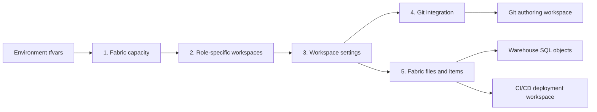

# End-to-end Terraform deployment

This guide follows the actual Terraform dependency graph from Azure capacity to
Fabric content. Use the stage pages to move from architecture to the owning code
without searching the repository.

See the [delivery scope matrix](../DELIVERY_SCOPE.md) for the screenshot-aligned
implemented, prerequisite, optional, and out-of-scope status of every item.

## Deployment path



| Stage | Guide | Owning code |
| --- | --- | --- |
| 1 | [Fabric capacity](01-capacity.md) | [`terraform/modules/capacity/`](../../terraform/modules/capacity) |
| 2 | [Fabric workspaces](02-workspaces.md) | [`terraform/modules/workspace/`](../../terraform/modules/workspace) |
| 3 | [Workspace settings](03-workspace-settings.md) | [`terraform/main.tf`](../../terraform/main.tf) and policy scripts |
| 4 | [Connect Git integration](04-git-integration.md) | `fabric_workspace_git` and caller credential setup |
| 5 | [Fabric files and item deployment](05-content-files.md) | [`fabric-git/`](../../fabric-git) and the items/SQL modules |

## Find each deployed resource

Use this map to move from a resource in Azure or Fabric to the code that owns
it. A **provider-managed API** call means Terraform sends the request through
the AzureRM or Fabric provider. A **direct API bridge** means repository code
constructs the HTTP request because the installed provider has no equivalent
resource. Do not run the optional numbered REST scripts against resources that
are already managed by Terraform.

Ownership is mode-dependent. Full-platform mode creates the resource group,
capacity, and both workspaces. Managed-existing mode uses a supplied capacity
and creates or imports both workspaces. Externally managed mode consumes
supplied workspace IDs without owning the capacity or workspace lifecycle.

| Resource or setting | Where it is deployed | Terraform owner | Direct or alternate API implementation |
| --- | --- | --- | --- |
| Azure resource group | Selected Azure subscription and region in full-platform mode | [`azurerm_resource_group.this`](../../terraform/main.tf) when `provision_platform = true`; external otherwise | The optional script path creates the group before deploying [`infra/capacity.bicep`](../../infra/capacity.bicep); no Fabric REST call. |
| Fabric capacity | Azure resource group as `Microsoft.Fabric/capacities` in full-platform mode | [`module.capacity`](../../terraform/main.tf) -> [`azurerm_fabric_capacity.this`](../../terraform/modules/capacity/main.tf) when `provision_platform = true`; supplied externally otherwise | AzureRM owns create/update. [`set-capacity-state.ps1`](../../scripts/powershell/set-capacity-state.ps1) uses ARM `GET` and `POST .../resume` before Terraform refresh. |
| CI/CD deployment workspace | Fabric tenant; Terraform assigns it to the selected capacity when workspaces are managed | [`module.workspace`](../../terraform/main.tf) -> [`fabric_workspace.this`](../../terraform/modules/workspace/main.tf) in full-platform or managed-existing mode; supplied by `workspace_id` otherwise | Fabric provider-managed API when managed. The optional flow uses [`03-create-workspace.ps1`](../../scripts/powershell/03-create-workspace.ps1) and [`04-assign-capacity.ps1`](../../scripts/powershell/04-assign-capacity.ps1). |
| Git authoring workspace | Fabric tenant; Terraform assigns it to the selected capacity when workspaces are managed | [`module.git_workspace`](../../terraform/main.tf) -> [`fabric_workspace.this`](../../terraform/modules/workspace/main.tf) in full-platform or managed-existing mode; supplied by `git_workspace_id` otherwise | Fabric provider-managed API when managed. Fabric Git synchronization, not Terraform, owns the definitions visible in this workspace. |
| Workspace role assignments | Selected CI/CD and/or Git workspace | [`fabric_workspace_role_assignment.this`](../../terraform/main.tf) | Fabric provider-managed API; the numbered REST flow does not manage roles. |
| Workspace inbound firewall | Each targeted managed workspace | [`terraform_data.workspace_firewall`](../../terraform/main.tf) | Direct Fabric REST bridge in [`set-fabric-workspace-firewall.ps1`](../../scripts/powershell/set-fabric-workspace-firewall.ps1). |
| Workspace customer-managed key | Each workspace named in `workspace_encryption` | [`terraform_data.workspace_encryption`](../../terraform/main.tf) | Direct Fabric REST bridge in [`set-fabric-workspace-encryption.ps1`](../../scripts/powershell/set-fabric-workspace-encryption.ps1). |
| Caller Git credentials | Git authoring workspace and current deployment identity | [`terraform_data.git_credentials`](../../terraform/main.tf) | Direct Fabric REST bridge in [`set-fabric-git-credentials.ps1`](../../scripts/powershell/set-fabric-git-credentials.ps1). |
| Git connection | Git authoring workspace only in the Terraform path | [`fabric_workspace_git.this`](../../terraform/main.tf) | Fabric provider-managed API. [`07-git-integration.ps1`](../../scripts/powershell/07-git-integration.ps1) is a legacy single-workspace REST fallback that targets the workspace in `.state.json`, not Terraform's dedicated Git workspace. |
| Lakehouse, Warehouse, Notebook, and optional extended items | CI/CD deployment workspace only in the Terraform path | [`module.items`](../../terraform/main.tf) -> [`terraform/modules/items/main.tf`](../../terraform/modules/items/main.tf) | Fabric provider-managed API honors `p0` or `all`. The optional [`05-deploy-items.ps1`](../../scripts/powershell/05-deploy-items.ps1) REST path always deploys all nine items. |
| Warehouse schema, tables, and stored procedures | Inside the Warehouse in the CI/CD workspace | [`module.sql`](../../terraform/main.tf) -> [`terraform_data.stored_procs`](../../terraform/modules/sql/main.tf) | TDS with an Entra SQL token, not REST. The optional path is [`06-deploy-stored-procedures.ps1`](../../scripts/powershell/06-deploy-stored-procedures.ps1). |

The private runner, remote state, and monitoring resources are a separate
Terraform root under [`terraform/runner-network/`](../../terraform/runner-network).
Deploy it before the core stack when GitHub-hosted runners need private state
access. It creates the runner VNet and subnets, NSG and route table, Azure
Firewall and public IP, private state storage and Blob private endpoint, private
DNS, RBAC, Log Analytics and firewall diagnostics, and the GitHub enterprise or
organization hosted-compute network settings. Its
[README](../../terraform/runner-network/README.md) maps
those resources and explains the required deployment order.

For the exact HTTP methods and routes behind every direct bridge and optional
script, continue to [REST API usage](../REST_API_USAGE.md). For provider and
Microsoft documentation, use the [deployment source catalog](../DEPLOYMENT_SOURCES.md).

## Choose a mode

| Goal | Key settings |
| --- | --- |
| Create the Azure resource group, capacity, and both workspaces | `provision_platform = true` |
| Use an existing capacity but manage both workspaces | `provision_platform = false`, `manage_workspaces = true`, and `fabric_capacity_id` |
| Use externally managed workspaces | `provision_platform = false`, `manage_workspaces = false`, `workspace_id`, and optional `git_workspace_id` |
| Deploy the CMK-compatible core item set | `item_deployment_profile = "p0"` |
| Deploy the complete demonstration item set | `item_deployment_profile = "all"` |

Start from [`terraform/environments/p0.tfvars.example`](../../terraform/environments/p0.tfvars.example)
for a new environment. Existing environments live under
[`terraform/environments/`](../../terraform/environments).

## Run the deployment

The guarded wrapper initializes environment-specific remote state, validates the
configuration, tests mocked plans, rejects unexpected deletes, applies a saved
plan, and requires a zero-change convergence plan.

```powershell
$env:TF_BACKEND_RESOURCE_GROUP = '<state-resource-group>'
$env:TF_BACKEND_STORAGE_ACCOUNT = '<state-account>'
$env:TF_BACKEND_CONTAINER = 'tfstate'

pwsh ./scripts/powershell/deploy-terraform.ps1 `
  -Environment dev `
  -VarFile ./terraform/environments/dev.tfvars
```

GitHub Actions runs the same wrapper from
[`.github/workflows/deploy-fabric.yml`](../../.github/workflows/deploy-fabric.yml).
The state account is private, so the runner must have network access to its Blob
private endpoint.

## Validate before apply

```powershell
terraform -chdir=terraform fmt -check -recursive
terraform -chdir=terraform init -backend=false -input=false
terraform -chdir=terraform validate
terraform -chdir=terraform test -no-color

pwsh ./scripts/powershell/validate-terraform-var-file.ps1 `
  -VarFile ./terraform/environments/dev.tfvars `
  -ExpectedEnvironment dev
```

## Ownership boundaries

- Full-platform mode owns the Azure resource group, capacity, and both
  role-specific workspaces. Managed-existing mode owns or imports both
  workspaces on a supplied capacity. Externally managed mode leaves the
  capacity and workspace-container lifecycle outside this root.
- In every mode, Terraform owns the enabled workspace settings, role grants,
  Git connection, CI/CD workspace items, and Warehouse SQL objects declared by
  this configuration.
- Fabric Git owns synchronization between the repository and the authoring
  workspace only; it does not own the CI/CD item definitions.
- The CI/CD workspace is deployment-owned; don't connect it to Fabric Git or
  edit Terraform-managed definitions there.
- Tenant settings, the Fabric Platform CMK enterprise application, repository
  creation, and portal-only Fabric Workspace monitoring remain administrator
  prerequisites or handoffs.

## Public promotion

Maintainers with a private upstream can publish shared implementation changes
without transferring private Git history. After the private `Deploy Fabric`
workflow succeeds on `main`, the publisher checks out public `main` separately,
copies only the byte-for-byte shared files listed in the private export
manifest, and runs the public hygiene, secret-scanning, Terraform, and script
validation gates. A unique promotion branch is then reviewed and merged through
the public repository's release workflow. Protected public `main` requires the
`Public release PR gate`; the publisher queues auto-merge and leaves the branch
available until that check succeeds. The PR gate runs trusted workflow code from
public `main` and accepts only same-repository promotion branches.

Files that intentionally contain public templates or private deployment
evidence are never synchronized by default. Adding a new path requires an
explicit allowlist change. A manual publisher dispatch covers documentation-only
changes that do not start the private deployment workflow.

## Learn more

- [AzureRM provider documentation](https://registry.terraform.io/providers/hashicorp/azurerm/latest/docs)
- [Microsoft Fabric provider documentation](https://registry.terraform.io/providers/microsoft/fabric/latest/docs)
- [Terraform dependency behavior](https://developer.hashicorp.com/terraform/language/resources/behavior)
- [AzureRM backend](https://developer.hashicorp.com/terraform/language/backend/azurerm)
- [Complete implementation and source catalog](../DEPLOYMENT_SOURCES.md)
