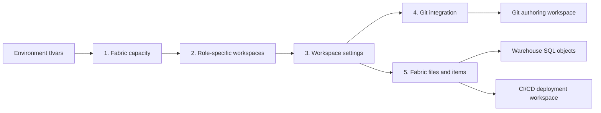

# End-to-end Terraform deployment

This guide follows the actual Terraform dependency graph from Azure capacity to
Fabric content. Use the stage pages to move from architecture to the owning code
without searching the repository.

See the [delivery scope matrix](../DELIVERY_SCOPE.md) for the screenshot-aligned
implemented, prerequisite, optional, and out-of-scope status of every item.

## Deployment path



| Stage | Guide | Owning code |
| --- | --- | --- |
| 1 | [Fabric capacity](01-capacity.md) | [`terraform/modules/capacity/`](../../terraform/modules/capacity) |
| 2 | [Fabric workspaces](02-workspaces.md) | [`terraform/modules/workspace/`](../../terraform/modules/workspace) |
| 3 | [Workspace settings](03-workspace-settings.md) | [`terraform/main.tf`](../../terraform/main.tf) and policy scripts |
| 4 | [Connect Git integration](04-git-integration.md) | `fabric_workspace_git` and caller credential setup |
| 5 | [Fabric files and item deployment](05-content-files.md) | [`fabric-git/`](../../fabric-git) and the items/SQL modules |

## Choose a mode

| Goal | Key settings |
| --- | --- |
| Create the Azure resource group, capacity, and both workspaces | `provision_platform = true` |
| Use an existing capacity but manage both workspaces | `provision_platform = false`, `manage_workspaces = true`, and `fabric_capacity_id` |
| Use externally managed workspaces | `provision_platform = false`, `manage_workspaces = false`, `workspace_id`, and optional `git_workspace_id` |
| Deploy the CMK-compatible core item set | `item_deployment_profile = "p0"` |
| Deploy the complete demonstration item set | `item_deployment_profile = "all"` |

Start from [`terraform/environments/p0.tfvars.example`](../../terraform/environments/p0.tfvars.example)
for a new environment. Existing environments live under
[`terraform/environments/`](../../terraform/environments).

## Run the deployment

The guarded wrapper initializes environment-specific remote state, validates the
configuration, tests mocked plans, rejects unexpected deletes, applies a saved
plan, and requires a zero-change convergence plan.

```powershell
$env:TF_BACKEND_RESOURCE_GROUP = '<state-resource-group>'
$env:TF_BACKEND_STORAGE_ACCOUNT = '<state-account>'
$env:TF_BACKEND_CONTAINER = 'tfstate'

pwsh ./scripts/powershell/deploy-terraform.ps1 `
  -Environment dev `
  -VarFile ./terraform/environments/dev.tfvars
```

GitHub Actions runs the same wrapper from
[`.github/workflows/deploy-fabric.yml`](../../.github/workflows/deploy-fabric.yml).
The state account is private, so the runner must have network access to its Blob
private endpoint.

## Validate before apply

```powershell
terraform -chdir=terraform fmt -check -recursive
terraform -chdir=terraform init -backend=false -input=false
terraform -chdir=terraform validate
terraform -chdir=terraform test -no-color

pwsh ./scripts/powershell/validate-terraform-var-file.ps1 `
  -VarFile ./terraform/environments/dev.tfvars `
  -ExpectedEnvironment dev
```

## Ownership boundaries

- Terraform owns Azure capacity infrastructure, the two role-specific Fabric
  workspaces, selected workspace settings, the CI/CD workspace items, and
  Warehouse SQL objects.
- Fabric Git owns synchronization between the repository and the authoring
  workspace only.
- The CI/CD workspace is deployment-owned; don't connect it to Fabric Git or
  edit Terraform-managed definitions there.
- Tenant settings, the Fabric Platform CMK enterprise application, repository
  creation, and portal-only Fabric Workspace monitoring remain administrator
  prerequisites or handoffs.

## Learn more

- [AzureRM provider documentation](https://registry.terraform.io/providers/hashicorp/azurerm/latest/docs)
- [Microsoft Fabric provider documentation](https://registry.terraform.io/providers/microsoft/fabric/latest/docs)
- [Terraform dependency behavior](https://developer.hashicorp.com/terraform/language/resources/behavior)
- [AzureRM backend](https://developer.hashicorp.com/terraform/language/backend/azurerm)
- [Complete implementation and source catalog](../DEPLOYMENT_SOURCES.md)
