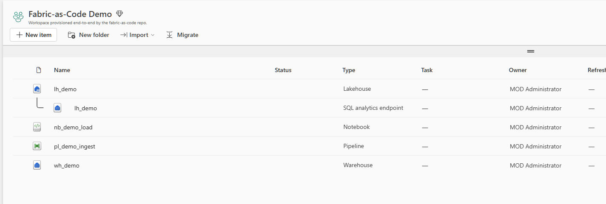
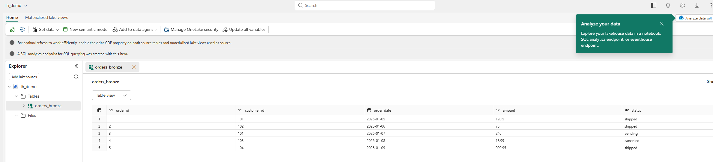
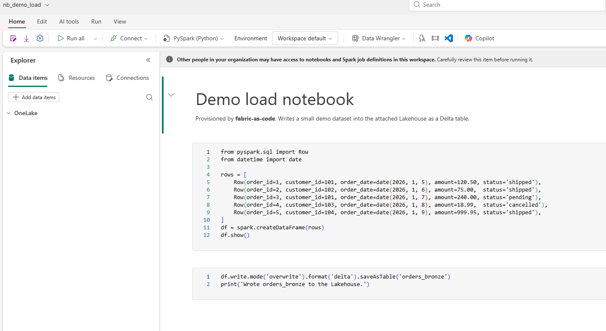
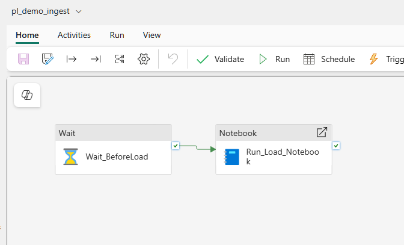
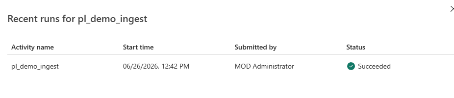
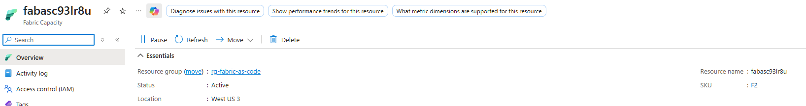

<!--
This is a Marp deck. Render/export it with the "Marp for VS Code" extension
(Export slide deck…) or the Marp CLI:
    npx @marp-team/marp-cli docs/presentation.md -o docs/Fabric-as-Code.pdf
A ready-made PPTX (docs/Fabric-as-Code.pptx) is generated by docs/build_pptx.py.
-->

# Fabric‑as‑Code

### Deploy Microsoft Fabric end‑to‑end — from nothing to a running analytics platform

Azure CLI · Bicep · Fabric REST APIs

---

## The problem: two control planes

Microsoft Fabric is governed by **two separate APIs** — the portal automates
neither in a repeatable way:

| Layer | Manages | Tooling here |
| --- | --- | --- |
| **Azure** | Fabric **capacity** (`Microsoft.Fabric/capacities`) — billable compute | Bicep + `az` |
| **Fabric** | **Workspaces** + **items** (Lakehouse, Warehouse, Notebook, Pipeline) | Fabric REST |
| **Data** | Objects *inside* an item — e.g. **stored procedures** | T‑SQL |

ARM/portal **cannot** create workspaces or items — only the Fabric REST API can.
That's why this repo combines **Bicep + REST + T‑SQL**.

---

## The building blocks — what each part does

| Component | What it is / does |
| --- | --- |
| **Capacity (F‑SKU)** | The compute every item runs on. Billed hourly; pause to stop. |
| **Workspace** | Logical container for items; must sit on a capacity. |
| **Lakehouse** | OneLake files + **Delta tables**; auto **SQL endpoint** (read‑only T‑SQL). |
| **Warehouse** | Full read/write **T‑SQL** engine: tables, views, **stored procs**, transactions. |
| **Notebook** | **Spark/PySpark** compute; bound to a Lakehouse to read/write tables. |
| **Data Pipeline** | Orchestrator (Data Factory‑style) chaining notebooks, copies, procs. |

---

## What the automation does (6 steps)

1. **Provision** resource group + Fabric capacity — `02` → `infra/capacity.bicep`
2. **Create** the workspace — `03` → `POST /v1/workspaces`
3. **Assign** workspace to capacity — `04` → `assignToCapacity` (unlocks items)
4. **Deploy items** — `05` → Lakehouse, Warehouse, Notebook, Pipeline
5. **Deploy stored procedures** — `06` → T‑SQL to the Warehouse SQL endpoint
6. *(optional)* **Connect to Git** — `07` → workspace under source control

Run individually to learn, or all at once with `deploy-all`.

---

## The deployment scripts

Numbered, **idempotent**, **`.env`‑driven** — PowerShell **and** bash:

| Script | Does |
| --- | --- |
| `00-prerequisites` | Checks `az`, `pwsh`/`bash`, sqlcmd, login |
| `01-login` | `az login` (interactive **or** service principal) |
| `02-provision-capacity` | Bicep deploy of the capacity |
| `03/04` | Create workspace · assign to capacity |
| `05-deploy-items` | Create the four items from definition files |
| `06-deploy-stored-procedures` | T‑SQL to the Warehouse (Entra token) |
| `99-teardown` | Delete workspace + resource group |

---

## How it stays reliable

- **Idempotent** — existing workspaces/items are detected and reused, not duplicated
- **State** — resolved GUIDs saved to `.state.json` between steps
- **Auth** — one `az` session mints tokens for both Fabric (`api.fabric.microsoft.com`)
  and SQL (`database.windows.net`); no extra tooling for stored procs
- **Long‑running ops** — REST helper polls `Operation-Location` until `Succeeded`
- **Templated definitions** — `__TOKENS__` in notebook/pipeline JSON are replaced
  with real GUIDs at deploy time → portable across tenants

---

## Repeatable across tenants & RGs

- All tenant/subscription/secret values live in a **git‑ignored `.env`**
- Duplicate per environment: `.env.dev`, `.env.customerA`, …
- Same scripts, different config → **identical** environment anywhere
- **Service‑principal** auth for CI/CD and multi‑tenant automation
- **Public repo:** contains **no secrets**

---

## Fabric — workspace contents

Every item created via the Fabric REST API (Lakehouse + its SQL endpoint,
Warehouse, Notebook, Pipeline). *Created by `03`–`05`.*



---

## Fabric — Lakehouse with data

`orders_bronze` **Delta table** (5 rows), written by the notebook run — the
bronze landing layer. *Auto SQL endpoint enables read‑only T‑SQL/BI.*



---

## Fabric — Notebook

`nb_demo_load` — **PySpark** builds the dataset and `saveAsTable` writes it to
the **attached Lakehouse**. *The Lakehouse binding is injected at deploy time.*



---

## Fabric — Data Pipeline

**Design:** Wait → Run Notebook (success dependency). **Run:** Succeeded.
*Orchestration that executed the notebook and populated the Delta table.*

 

---

## Azure — Fabric capacity

The billable `Microsoft.Fabric/capacities` (F2) — the compute all items run on.
*Deployed by Bicep; pause to stop hourly billing.*



---

## What you can build on this

- **Medallion platform** — Lakehouse bronze/silver/gold + Spark notebooks
- **SQL warehousing** — Warehouse with versioned schema, tables & stored procs
- **Orchestration** — Pipelines chaining notebooks, copies & procedures
- **Promotion** — Git integration + deployment pipelines (dev → test → prod)
- **Governance as code** — capacity sizing, admins & RBAC in source control

---

## Get started

```bash
git clone https://github.com/<owner>/fabric-as-code
cd fabric-as-code
cp .env.example .env        # fill in tenant / subscription / capacity
pwsh ./scripts/powershell/deploy-all.ps1   # or ./scripts/bash/deploy-all.sh
```

Tear it all down (capacity + workspace) with `99-teardown`.

**Thank you!** — questions welcome.
