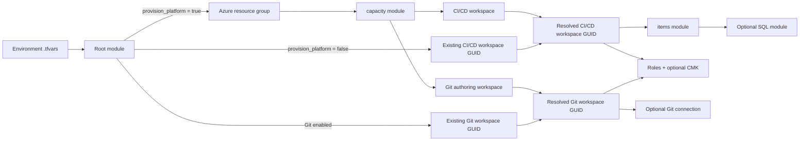

# Fabric-as-Code - Terraform

This Terraform configuration supports two modes from the same root module:

- `provision_platform = true` creates the Azure resource group, Fabric capacity, a Git authoring workspace, a CI/CD deployment workspace, and the CI/CD workspace items.
- `provision_platform = false` uses an existing capacity. Set `manage_workspaces = true` to create or import both role-specific workspaces into Terraform state; leave it false only when the workspaces are managed elsewhere.

It also supports two item profiles:

- `item_deployment_profile = "p0"` creates the P0 Lakehouse, Warehouse, and Notebook. Use this profile when assigning a customer-managed key to the CI/CD workspace.
- `item_deployment_profile = "all"` preserves the complete nine-item demo and is the default for existing deployments.

For a sequential walkthrough, start with the
[end-to-end deployment guide](../docs/deployment/README.md):
[capacity](../docs/deployment/01-capacity.md),
[workspaces](../docs/deployment/02-workspaces.md),
[workspace settings](../docs/deployment/03-workspace-settings.md),
[Git integration](../docs/deployment/04-git-integration.md), and
[content files](../docs/deployment/05-content-files.md).

## How the Configuration Fits Together

Terraform loads every `.tf` file in this directory as one root module. The filenames organize the configuration for people; they do not control execution order. References between resources and modules form the dependency graph that Terraform uses to plan and apply changes.



Inside the items module, references create a second dependency chain:

- The Eventhouse is created before the writable KQL Database that points to it.
- The Lakehouse is created before the Notebook whose definition receives the Lakehouse ID.
- The Notebook is created before the Data Pipeline whose definition receives the Notebook ID.
- The Warehouse exposes the SQL endpoint consumed by the optional SQL module.

## File-by-File Tour

| File or directory | Responsibility | Useful explanation |
| --- | --- | --- |
| [`../docs/deployment/`](../docs/deployment) | Provides the ordered operator walkthrough. | Each stage links to its owning Terraform resources and official provider documentation. |
| [`providers.tf`](providers.tf) | Pins Terraform and provider versions, selects the private Azure Blob backend, and configures Azure CLI authentication. | `azurerm` manages Azure resources; `fabric` manages Fabric resources. The backend uses GitHub OIDC or an authenticated Azure CLI without storage keys. |
| [`variables.tf`](variables.tf) | Defines and validates the root module contract. | `provision_platform` is the main mode switch. Environment files supply the tenant, subscription, names, and optional existing item IDs. |
| [`main.tf`](main.tf) | Orchestrates the platform, role-specific workspaces, content, Git, and SQL modules. | `local.cicd_workspace_id` and `local.git_workspace_id` keep definition ownership separate in both deployment modes. |
| [`imports.tf`](imports.tf) | Declares conditional imports for existing Fabric items and a state migration for the former SQL marker. | An item ID imports `<workspace-id>/<item-id>` only in existing-workspace mode; a missing ID means Terraform creates that item. |
| [`outputs.tf`](outputs.tf) | Publishes the workspace, capacity, Git state, and item GUIDs. | Outputs make identifiers available to operators, automation, and other Terraform configurations. |
| [`environments/`](environments) | Holds environment-specific variable values. | Dev and prod use the same code but distinct names and state paths. These files should contain configuration, not credentials. |
| [`modules/capacity/`](modules/capacity) | Creates the Azure Fabric capacity and resolves its Fabric object GUID. | The Azure resource ID and Fabric object GUID identify the same capacity in different APIs; the workspace needs the Fabric GUID. |
| [`modules/workspace/README.md`](modules/workspace/README.md) | Creates a Fabric workspace on the resolved capacity. | The root calls this module once for each workspace role in full-platform mode. |
| [`modules/items/README.md`](modules/items/README.md) | Manages nine Fabric items and updates Notebook and Pipeline definitions from source files. | Terraform substitutes workspace and item IDs into shared definitions during apply, avoiding generated copies in the repository. |
| [`modules/sql/README.md`](modules/sql/README.md) | Runs ordered SQL files against the Warehouse when their content changes. | `terraform_data` represents an imperative edge because the provider has no native resource for executing T-SQL. |
| [`tests/deployment_modes.tftest.hcl`](tests/deployment_modes.tftest.hcl) | Plans against mocked providers and asserts both deployment modes and required inputs. | Tests inspect Terraform's graph without creating Azure or Fabric resources. |
| [`runner-network/`](runner-network) | Bootstraps the VNet-injected GitHub larger runner, Azure Firewall, and private state backend. | This is a separate state boundary because it must exist before the ephemeral deployment runner starts. |

## What Happens During an Apply

1. Terraform initializes the private Azure Blob backend and downloads the locked `azurerm` and `fabric` providers.
2. Variable validation rejects an incomplete platform configuration or a missing existing workspace GUID before deployment.
3. In full-platform mode, Terraform creates the resource group and capacity, resolves the capacity's Fabric GUID, and creates separate CI/CD and Git workspaces. With `manage_workspaces = true`, it uses the supplied `fabric_capacity_id` and creates or imports both workspaces there.
4. Native `fabric_workspace_role_assignment` resources apply the configured Admin, Member, Contributor, or Viewer grants to either or both workspaces.
5. Optional CMK markers assign, rotate, or reset versionless Key Vault keys through Fabric's GA workspace-encryption API and wait for the terminal state before Git or items deploy.
6. Git integration optionally connects the authoring workspace and initializes it from the remote repository with `PreferRemote`.
7. Conditional import blocks adopt any supplied existing item IDs into the CI/CD workspace. Items without IDs are planned as new resources.
8. The items module creates the three P0 items or the complete nine-item set only in the CI/CD workspace.
9. When enabled, the SQL module hashes the ordered SQL files. A changed hash or Warehouse ID replaces only the `terraform_data` marker and reruns the deployment script.
10. Terraform records both workspace identities and the item identities in state and exposes their GUIDs as outputs.

## Terraform Patterns to Point Out

- **Conditional resources:** `count` turns platform, Git, and SQL resources on or off without maintaining separate root modules.
- **Role-specific inputs:** `local.cicd_workspace_id` and `local.git_workspace_id` hide creation mode without allowing Git and Terraform to own the same workspace definitions.
- **Implicit dependencies:** References such as `fabric_eventhouse.this.id` tell Terraform what must exist first.
- **Declarative adoption:** `import` blocks bring existing Fabric items under management using the same configuration that will maintain them.
- **Imperative bridge:** `terraform_data` reruns SQL only when the Warehouse or SQL content changes.

## Managed Resources

- Optional Azure resource group, Fabric capacity, CI/CD workspace, and Git authoring workspace
- Fabric workspace role assignments for users, groups, service principals, and service-principal profiles
- Optional workspace CMK assignment, rotation, and reset using a versionless Azure Key Vault or Managed HSM key URI
- Optional Fabric workspace IP firewall rules that admit only the deployment firewall address while preserving existing named rules
- P0 Lakehouse, Warehouse, and Notebook in the CI/CD workspace
- Optional extended Environment, Eventhouse, writable KQL Database, Variable Library, ML Experiment, and Data Pipeline in the `all` profile
- Lakehouse, Notebook, and optional Data Pipeline definitions from [`../fabric-git`](../fabric-git)
- Optional workspace Git connection and initialization through `fabric_workspace_git`
- Warehouse schema, tables, and stored procedures through a `terraform_data` provisioner

Every selected Fabric item resource uses `prevent_destroy`. The CI runner also rejects infrastructure deletes. It permits state-marker replacement and explicit workspace role-assignment deletion so access can be revoked declaratively.

## Providers

- [`hashicorp/azurerm`](https://registry.terraform.io/providers/hashicorp/azurerm/latest/docs) optionally manages the resource group and capacity.
- [`microsoft/fabric`](https://registry.terraform.io/providers/microsoft/fabric/latest/docs) manages the workspace, Git connection, and items and authenticates through the Azure CLI session.
- Terraform's built-in `terraform_data` resource reruns the SQL provisioner when the SQL file hash changes.

Provider versions are pinned by `.terraform.lock.hcl`.

## Inputs

For a P0 environment, copy [`environments/p0.tfvars.example`](environments/p0.tfvars.example) to `environments/<environment>.tfvars` and replace its placeholders. Its role-assignment GUIDs, TEST-NET firewall address, and Key Vault URIs are intentionally synthetic so all security controls are visible in a plan without embedding customer identifiers. For the complete demo, start from [`environments/dev.tfvars`](environments/dev.tfvars) or [`environments/prod.tfvars`](environments/prod.tfvars). Those two files carry `# deployment: template`; replace every placeholder and remove the marker before deployment. Every deployable environment file gets a distinct state key.

For existing infrastructure, start with [`terraform.tfvars.example`](terraform.tfvars.example). Set `manage_workspaces = true`, `fabric_capacity_id`, `workspace_id`, and `git_workspace_id` to import both live workspaces. `workspace_id` identifies the CI/CD deployment target; `git_workspace_id` identifies the separate authoring workspace. Existing item IDs are optional: set an ID to import that item into CI/CD, or leave it `null` to create the item.

`git_integration` is optional and defaults to `null`. It always targets the dedicated authoring workspace and defaults to `PreferRemote`; Terraform-managed item definitions always target the CI/CD workspace.

`workspace_role_assignments` is keyed by a stable Terraform name. Each entry selects `cicd`, `git`, or both workspaces and declares the principal GUID, principal type, and Fabric role. Removing an entry plans deletion of that grant, so review role changes like any other access-policy change.

`workspace_encryption` is keyed by `cicd` or `git`. An enabled entry requires a versionless key URI such as `https://<vault>.vault.azure.net/keys/<key>`. Set `enabled = false` to explicitly reset a previously managed workspace to Microsoft-managed encryption; removing the map entry leaves its current encryption setting unmanaged. CMK on `cicd` requires the `p0` profile because the `all` profile contains item types outside Microsoft's documented CMK support list.

Set `fabric_workspace_firewall_ip` to the runner-network firewall public IP to preserve existing rules, add the deployment address to both managed workspaces, and set their public default action to deny before Git or item deployment. Leave it null or empty when workspace firewall management is external or the required Fabric tenant controls aren't enabled.

`workspace_security_monitoring_enabled` controls the authenticated post-deployment and scheduled canaries. Terraform output `workspace_security_summary` exposes the configured firewall targets, CMK targets, role-assignment count, monitoring state, and the manual portal lifecycle of native Fabric Workspace monitoring.

## Local Usage

The Fabric capacity must be active while Terraform creates, reads, or updates items. The machine must also resolve the state account through its private endpoint. Use a separate Blob key for every environment.

```powershell
$env:TF_BACKEND_RESOURCE_GROUP = '<state-resource-group>'
$env:TF_BACKEND_STORAGE_ACCOUNT = '<storage-account>'
$env:TF_BACKEND_CONTAINER = 'tfstate'
terraform init -reconfigure `
	-backend-config="resource_group_name=$env:TF_BACKEND_RESOURCE_GROUP" `
	-backend-config="storage_account_name=$env:TF_BACKEND_STORAGE_ACCOUNT" `
	-backend-config="container_name=$env:TF_BACKEND_CONTAINER" `
	-backend-config="key=dev/terraform.tfstate" `
	-backend-config="use_azuread_auth=true" `
	-backend-config="use_cli=true"
terraform validate
terraform plan -var-file=environments/dev.tfvars -out=dev.tfplan
terraform apply dev.tfplan
```

The guarded runner validates formatting, runs the mocked deployment-mode tests, rejects destructive plans, and verifies convergence:

```powershell
pwsh ../scripts/powershell/deploy-terraform.ps1 -Environment dev -VarFile ./environments/dev.tfvars
```

## GitHub Actions

The workflow authenticates with GitHub OIDC through `azure/login`; the Blob backend uses OIDC directly, while both providers reuse the isolated Azure CLI session. Terraform values come from committed `terraform/environments/<environment>.tfvars` files:

- An unprivileged pull-request workflow validates every added or changed environment file with no OIDC token, GitHub Environment, private runner, or remote backend. It runs formatting, provider validation, mocked plan tests, and a strict tfvars plan that rejects warnings and undeclared keys.
- After merge, a trusted push to `main` plans and applies those same environment files and requires a zero-change convergence plan.
- A shared Terraform, PowerShell, workflow, or `fabric-git` change plans/deploys every non-template environment file.
- A manual run selects one environment and resolves its matching tfvars file.

Deleting or renaming an environment file is blocked because the filename defines its Blob state key. Retire its resources/state or migrate the state key explicitly before changing that path.

Each matrix target uses the matching GitHub Environment for OIDC, approvals, concurrency, and backend access. GitHub variables hold only runner/auth/backend controls: `AZURE_CLIENT_ID`, `AZURE_TENANT_ID`, `AZURE_SUBSCRIPTION_ID`, `TF_STATE_RESOURCE_GROUP`, `TF_STATE_STORAGE_ACCOUNT`, `TF_STATE_CONTAINER`, `RUNNER_NETWORK_RESOURCE_GROUP`, `RUNNER_FIREWALL_POLICY_NAME`, `RUNNER_FIREWALL_RULE_COLLECTION_GROUP_NAME`, and the optional workspace-firewall controls. The deploy script rejects a tfvars tenant, subscription, or environment that does not match the selected authenticated target.

For VNet deployment, the repository must be owned by a GitHub organization. Create an organization network configuration and larger Windows runner group, grant the repository access, and set repository or organization variable `FABRIC_RUNNER_LABELS` to that runner's JSON label array. Set `FABRIC_ENABLE_SCHEDULED_CANARY=true` only after that runner and the monitored `dev` environment are ready. A personal-account repository can't consume the Azure `GitHub.Network/networkSettings` resource. The runner-network stack forces runner egress through Azure Firewall, blocks inbound connections, and privately resolves the state account. GitHub Environment variables `TF_STATE_RESOURCE_GROUP`, `TF_STATE_STORAGE_ACCOUNT`, `TF_STATE_CONTAINER`, and `FABRIC_DEPLOYMENT_EGRESS_IP` come directly from that stack's outputs. `FABRIC_MANAGE_WORKSPACE_FIREWALL` defaults to `false`; enable it only after a Fabric administrator enables both workspace-level inbound network rules and workspace-level IP firewall rules for the tenant.

State is stored as `<environment>/terraform.tfstate` in private Blob storage. Azure Blob provides native locking; versioning and 30-day soft deletion replace local backup copies. Preserve and migrate each former local state before the first hosted run.

## CMK prerequisites

Terraform manages the workspace assignment, rotation, status polling, and explicit reset. A security/bootstrap owner must first:

1. Enable the Fabric tenant setting **Apply customer-managed keys**.
2. Create the tenant service principal for the **Fabric Platform CMK** app ID `61d6811f-7544-4e75-a1e6-1c59c0383311`.
3. Use an RSA Key Vault or Managed HSM key with soft delete and purge protection, and grant that service principal get, wrap, and unwrap permissions (normally **Key Vault Crypto Service Encryption User**).
4. Keep the key URI versionless so Fabric can follow rotation.

The deployment identity must be a workspace Admin to call Assign or Reset Workspace Encryption. The CMK bridge uses only the public GA endpoints documented in [Customer-managed keys for Fabric workspaces](https://learn.microsoft.com/fabric/security/workspace-customer-managed-keys).

## Monitoring boundary

The P0 monitoring path is fully automated where Microsoft exposes stable contracts: the runner-network Terraform stack sends Azure Firewall logs and metrics to Log Analytics. Every successful deployment and the scheduled `Verify Fabric Network` workflow check private state DNS, service tags, deployed firewall policy, authenticated Fabric REST, optional CMK status/key, workspace inbound policy, and Warehouse TDS. Both canaries read the monitored resource IDs and expected CMK directly from Terraform output. Before Azure login, the scheduled job queries the Actions API and skips itself when a deployment is queued or running.

For a role grant that already exists, the Fabric role-assignment ID is its principal ID. Import it before apply with `<workspace-id>/<principal-id>`, targeting the expanded key, for example `fabric_workspace_role_assignment.this["cicd.platform_admins"]`.

Fabric-native **Workspace monitoring** remains a manual portal handoff. The current Microsoft setup article documents no public lifecycle API, and the installed Fabric provider has no corresponding resource, so this repository does not call the portal's private endpoint. A Fabric admin must enable **Workspace admins can turn on monitoring for their workspaces**, then a workspace Admin selects **Workspace settings > Monitoring > + Eventhouse**. Keep that handoff until Microsoft publishes a supported lifecycle API. See [Workspace Monitoring overview](https://learn.microsoft.com/fabric/fundamentals/workspace-monitoring-overview) and [Enable Workspace monitoring](https://learn.microsoft.com/fabric/fundamentals/enable-workspace-monitoring).

See [`runner-network/README.md`](runner-network/README.md) for provisioning, GitHub binding, required domains, workspace allowlisting, and state migration.

## SQL

Terraform has no native Fabric T-SQL execution resource. The Fabric provider supplies the Warehouse connection string, and [`modules/sql/deploy-procs.ps1`](modules/sql/deploy-procs.ps1) uses an Azure CLI SQL token plus .NET `SqlClient`. The `terraform_data` replacement trigger combines the Warehouse ID with hashes of the deployment script and the files under [`../fabric-git/sql`](../fabric-git/sql).

On the first run after upgrading from the former `null_resource` hook, Terraform forgets that state-only marker with `destroy = false` and creates the built-in marker. No Fabric or Azure resource is destroyed.

The default workflow makes direct REST calls only where the providers don't expose the required lifecycle; it leaves capacity active after deployment. See [`../docs/REST_API_USAGE.md`](../docs/REST_API_USAGE.md) for the complete boundary, [`../docs/DEPLOYMENT_SOURCES.md`](../docs/DEPLOYMENT_SOURCES.md) for authoritative documentation for every component, and [`../docs/WORKING_WITH_FABRIC.md`](../docs/WORKING_WITH_FABRIC.md) before combining Terraform deployments with authoring in the Fabric UI or Fabric Git integration.
