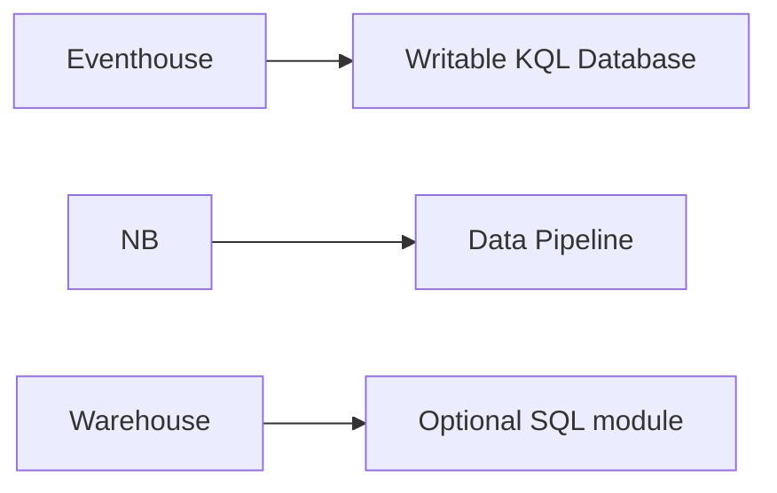

# Items module

Browse the [content files deployment guide](../../../docs/deployment/05-content-files.md)
for the source-to-resource flow. Learn more in the official
[Microsoft Fabric provider documentation](https://registry.terraform.io/providers/microsoft/fabric/latest/docs).

This module always manages the P0 items in one Fabric workspace:

- Lakehouse
- Warehouse
- Notebook

With `deploy_extended_items = true`, it also manages:

- Spark Environment
- Eventhouse
- Writable KQL Database
- Variable Library
- ML Experiment
- Data Pipeline

## Dependency graph

Terraform derives creation order from resource references:

The KQL Database configuration contains the Eventhouse ID. The Data Pipeline definition receives the target Notebook and workspace IDs. These references prevent dependent content from being rendered before its identifiers exist.

## Source-controlled definitions

Fabric Git-native content under the repository-level `fabric-git/` directory is canonical for both workspaces:

| Definition | Terraform behavior |
| --- | --- |
| `lh_git_authoring_demo.Lakehouse/*.json` | Reconciles the same ALM and metadata definition in CI/CD. |
| `nb_git_authoring_demo.Notebook/notebook-content.py` | Deploys the same Python source unchanged. |
| `pl_git_authoring_demo.DataPipeline/pipeline-content.json` | Replaces the authoring Notebook logical ID and neutral workspace ID with CI/CD runtime IDs in memory. |

The `.platform` files remain Fabric Git metadata. Terraform reads the Notebook logical ID from `.platform` for reference translation but does not send `.platform` as an item definition part. No rendered copies are written back to the repository.

## Adoption and deletion safety

The root `imports.tf` file can adopt an existing item when the corresponding `*_id` variable is supplied in existing-workspace mode. Fabric import IDs use `<workspace-id>/<item-id>`. After import, this module manages the item's configured name, description, definition, and relationships.

Every item has `prevent_destroy = true`. A rename or in-place update can still be planned, but a delete or replacement is rejected before apply. The guarded CI runner independently rejects delete actions as a second safety boundary.

The root maps `item_deployment_profile = "p0"` to `deploy_extended_items = false`. This P0 profile is compatible with the documented workspace-CMK item list. The default `all` profile retains the complete demo. Moved blocks preserve the former unindexed addresses of extended items when upgrading an existing `all` deployment.

The Warehouse connection string output is an endpoint, not a credential. It is passed to the SQL module; that module obtains a short-lived Entra token at execution time.
