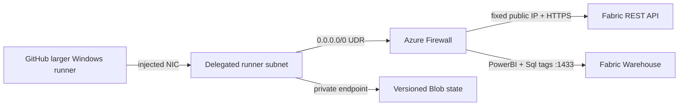

# GitHub-hosted runner network

This bootstrap root creates the Azure network boundary used by a GitHub-hosted
larger Windows runner to deploy this repository to Microsoft Fabric.



## Resource destination map

This directory is a separate Terraform root and state boundary. Nothing in
this table is created by the core [`terraform/`](../) apply.

| Resource or setting | Where it is deployed | Terraform owner in [`main.tf`](main.tf) |
| --- | --- | --- |
| GitHub resource provider registration | Azure subscription | `azurerm_resource_provider_registration.github_network` |
| Bootstrap resource group | Selected Azure subscription and region | `azurerm_resource_group.this` |
| VNet and runner, firewall, and private-endpoint subnets | Bootstrap Azure resource group | `azurerm_virtual_network.this` and the three `azurerm_subnet` resources |
| Runner inbound protection | Runner subnet | `azurerm_network_security_group.runners` and its subnet association |
| Fixed egress and allowed destinations | Azure Firewall subnet and policy in the bootstrap resource group | `azapi_resource.firewall_public_ip`, `azurerm_firewall_policy.this`, `azurerm_firewall.this`, and `azurerm_firewall_policy_rule_collection_group.runner_egress` |
| Forced runner egress | Runner subnet | `azurerm_route_table.runners` and its subnet association |
| Private Terraform state | Storage account, Blob service, and container in the bootstrap resource group | `azapi_resource.state`, `azapi_resource.state_blob_service`, and `azapi_resource.state_container` |
| Private Blob resolution | Private-endpoint subnet and VNet-linked private DNS zone | `azurerm_private_endpoint.state_blob`, `azurerm_private_dns_zone.blob`, and its VNet link |
| Deployment identity access | State container and bootstrap resource group | `azurerm_role_assignment.state_blob_data` and `azurerm_role_assignment.runner_network_reader` |
| Firewall monitoring | Log Analytics workspace plus diagnostic setting on Azure Firewall | `azurerm_log_analytics_workspace.firewall` and `azurerm_monitor_diagnostic_setting.firewall` |
| Hosted-compute network binding | `GitHub.Network/networkSettings` resource in the bootstrap resource group, bound to the GitHub business ID and runner subnet | `azapi_resource.github_network_settings` |

Terraform creates the Azure network settings object, but a GitHub enterprise or
organization owner still creates the runner group and larger runner in GitHub.
Fabric tenant settings and workspace-level firewall eligibility are also
administrator prerequisites; they are not resources in this root.

## Why this shape

- Azure VNet injection is available only for GitHub-hosted **larger** Ubuntu and
  Windows runners, not standard hosted runners. See [GitHub's Azure private
  networking overview](https://docs.github.com/en/organizations/managing-organization-settings/about-azure-private-networking-for-github-hosted-runners-in-your-organization#about-using-larger-runners-with-azure-vnet).
- GHE.com data-residency geographies support specific Azure regions for x64
  VNet runners. Select the geography and a supported region for your enterprise.
  See [GHE.com network details](https://docs.github.com/en/enterprise-cloud@latest/admin/data-residency/network-details-for-ghecom#supported-regions-for-azure-private-networking).
- Azure Firewall explicit proxy supports only HTTP/S. This repository also
  deploys T-SQL over TCP `1433`, so a UDR sends all egress through the firewall's
  transparent path. See [Azure Firewall explicit proxy](https://learn.microsoft.com/azure/firewall/explicit-proxy).
- Warehouse endpoints can resolve into either the `PowerBI` or `Sql` service
  tag, so both tags are allowed on TCP `1433` as required by
  [Fabric Warehouse connectivity](https://learn.microsoft.com/fabric/data-warehouse/connectivity#allow-azure-service-tags-through-firewall).
- Azure Firewall and Standard public IP omit explicit zone numbers because new
  deployments are zone-redundant by default in supported regions. This also
  avoids requiring subscription features used only by explicit zonal placement.
- GitHub recommends domain controls from `api.github.com/meta`. Its static IP
  template was retired after July 1, 2026. See [GitHub's DNS/domain guidance](https://docs.github.com/en/organizations/managing-organization-settings/configuring-private-networking-for-github-hosted-runners-in-your-organization#dnsdomain-control-recommended).
- GHE.com additionally requires the dedicated enterprise hostname and its
  Actions/Pages subdomains, `auth.ghe.com`, GitHub assets, and web storage. Those
  rules are derived from `github_enterprise_hostname` in this stack.
- Ephemeral hosted runners cannot retain local Terraform state. The private Blob
  backend uses Entra authentication, locking, versioning, and soft deletion. See
  [the Terraform AzureRM backend](https://developer.hashicorp.com/terraform/language/backend/azurerm).

## Prerequisites

- Enterprise-owner access for initial GHE.com hosted-compute networking. By
  default, organizations inherit enterprise configurations until enterprise
  policy permits independent organization network configurations.
- An Azure identity able to register `GitHub.Network` and create the resources in
  this root. GitHub documents Subscription Contributor and Network Contributor
  for network setup. Because this root also grants state-container access, the
  bootstrap identity additionally needs Owner, User Access Administrator, or
  Role Based Access Control Administrator at the applicable scope.
- The Fabric workflow OIDC identity's **object ID** for the state role assignment.
- A globally unique lowercase storage account name.
- Terraform and an authenticated Azure CLI session.
- The `Microsoft.Fabric` resource provider re-registered in the subscription
  containing the capacity before workspace-level networking is used, as required
  by [Fabric's firewall prerequisites](https://learn.microsoft.com/fabric/security/security-workspace-level-firewall-set-up#prerequisites).

Re-register the Fabric resource provider before applying workspace firewall rules:

```powershell
az provider register --namespace Microsoft.Fabric --wait
```

Get the initial GitHub enterprise business ID:

```powershell
gh api graphql --hostname <customer-subdomain>.ghe.com `
  -f query='query($slug:String!){enterprise(slug:$slug){databaseId}}' `
  -f slug='<enterprise-slug>' `
  --jq '.data.enterprise.databaseId'
```

## Provision Azure

```powershell
Copy-Item `
  ./terraform/runner-network/runner-network.tfvars.example `
  ./terraform/runner-network/runner-network.tfvars

terraform -chdir=terraform/runner-network init
terraform -chdir=terraform/runner-network test
terraform -chdir=terraform/runner-network plan `
  -var-file=runner-network.tfvars `
  -out=runner-network.tfplan
terraform -chdir=terraform/runner-network apply runner-network.tfplan
```

Preserve this bootstrap root's local state securely. It owns the subnet service
association link, firewall, and the private backend that the main Fabric root
uses. Do not run it from an ephemeral runner until its own state has been moved
to a durable backend.

Record these outputs:

```powershell
terraform -chdir=terraform/runner-network output github_network_settings_id
terraform -chdir=terraform/runner-network output firewall_public_ip_address
terraform -chdir=terraform/runner-network output -json fabric_backend_config
```

## Bind GitHub

1. For initial setup, open enterprise **Settings > Hosted compute networking**.
  Organization settings can be used only when enterprise policy enables them.
2. Create an **Azure private network** configuration and enter
   `github_network_settings_id` from Terraform.
3. Create a runner group, attach that network configuration, and grant this
   repository access.
4. Add a larger Windows runner to the group, for example
  `fabric-vnet-runner`. Disable a public IP on the runner.
5. Define repository or organization variable `FABRIC_RUNNER_LABELS` as
  `["fabric-vnet-runner"]`. It cannot be environment-scoped because runner
   selection happens before environment variables are loaded.

## Configure the deployment environment

Set these GitHub Environment variables from the Terraform outputs:

| Variable | Value |
| --- | --- |
| `TF_STATE_RESOURCE_GROUP` | `fabric_backend_config.resource_group_name` |
| `TF_STATE_STORAGE_ACCOUNT` | `fabric_backend_config.storage_account_name` |
| `TF_STATE_CONTAINER` | `fabric_backend_config.container_name` |
| `FABRIC_DEPLOYMENT_EGRESS_IP` | `firewall_public_ip_address` |
| `FABRIC_MANAGE_WORKSPACE_FIREWALL` | `false` until both Fabric tenant controls are enabled; then `true` |

The existing `AZURE_CLIENT_ID`, `AZURE_TENANT_ID`, and
`AZURE_SUBSCRIPTION_ID` variables are also used by the OIDC Blob backend. The
workflow validates Fabric REST connectivity before Terraform initializes.
Azure Firewall controls runner egress regardless of the workspace setting.
When `FABRIC_MANAGE_WORKSPACE_FIREWALL=true`, Terraform also applies the fixed
egress IP to both managed Fabric workspaces before deploying Git or item
resources. This requires both Advanced networking controls documented in
[Enable workspace inbound access protection](https://learn.microsoft.com/fabric/security/security-workspace-enable-inbound-access-protection).

Because this repository was created after July 15, 2026, its Entra federated
credential must use GHE.com's issuer and GitHub's immutable subject format:

```text
issuer:  https://token.actions.<customer-subdomain>.ghe.com
subject: repo:<organization>@<owner-id>/<repository>@<repository-id>:environment:<environment>
audience: api://AzureADTokenExchange
```

Retrieve the non-secret owner and repository IDs with:

```powershell
gh api --hostname <customer-subdomain>.ghe.com `
  repos/<organization>/<repository> `
  --jq '{ownerId:.owner.id, repositoryId:.id}'
```

For an existing workspace that already denies this runner, seed the firewall IP
once from an already permitted admin network. Fabric documents the REST and
portal procedures in [Set up workspace IP firewall rules](https://learn.microsoft.com/fabric/security/security-workspace-level-firewall-set-up).

## Migrate existing state

Do not start the hosted workflow against an empty backend. From the current
state-owning runner, connect to this VNet (or run from a temporary VM in it) so
the storage hostname resolves to its private endpoint. Then migrate each
environment from the existing local backend:

```powershell
$env:ARM_USE_AZUREAD = 'true'
$env:ARM_USE_CLI = 'true'

terraform -chdir=terraform init -migrate-state -force-copy `
  -backend-config='resource_group_name=<state-resource-group>' `
  -backend-config='storage_account_name=<storage-account>' `
  -backend-config='container_name=tfstate' `
  -backend-config='key=dev/terraform.tfstate' `
  -backend-config='use_azuread_auth=true' `
  -backend-config='use_cli=true'
```

Confirm `terraform plan` is zero-change before switching
`FABRIC_RUNNER_LABELS` to the larger runner.